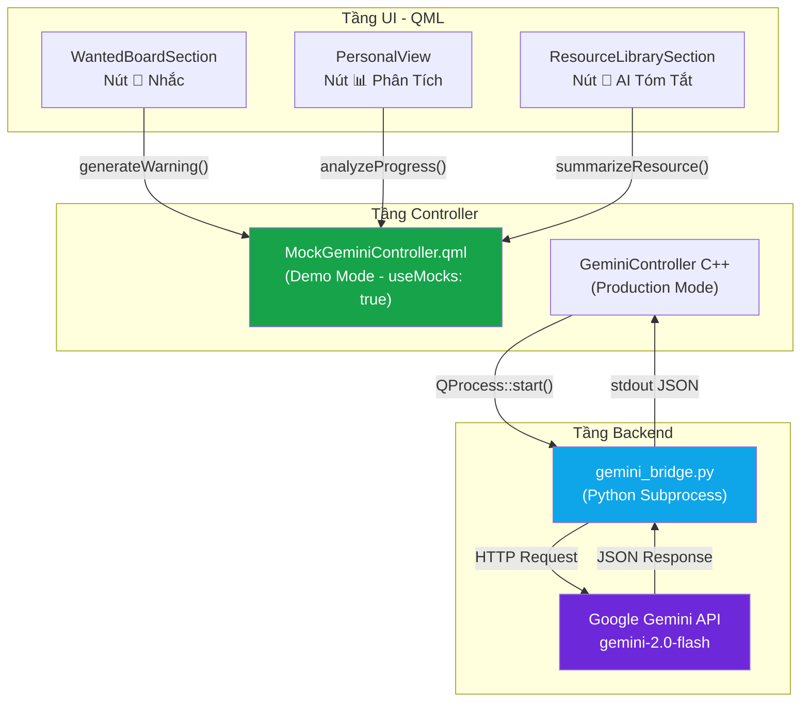
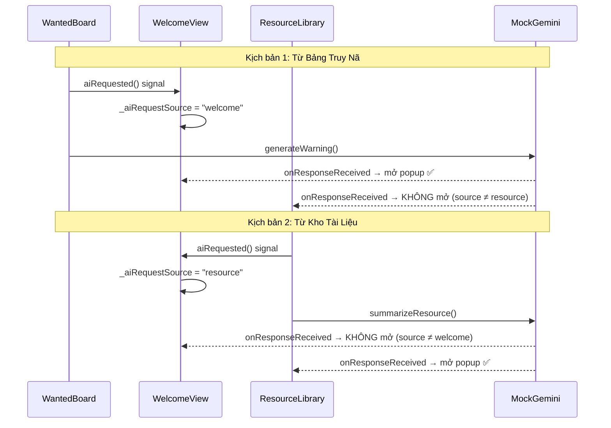
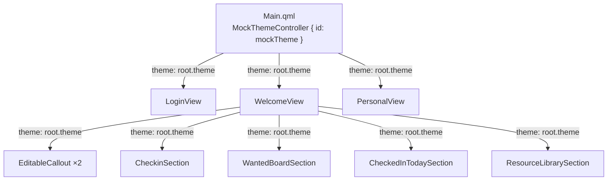
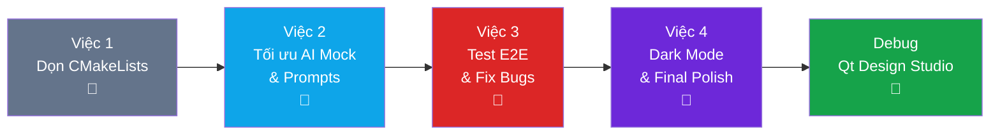

# 📋 BÁO CÁO CÔNG VIỆC — NGƯỜI C
## Chuyên viên tích hợp AI & Tối ưu trải nghiệm người dùng

**Dự án:** English Mastery Hub  
**Công nghệ nền tảng:** C++ / Qt 6.11 / QML  
**Ngày hoàn thành:** 03/05/2026  

---

## 1. TỔNG QUAN VAI TRÒ

Người C chịu trách nhiệm **tích hợp trí tuệ nhân tạo (AI)** vào ứng dụng English Mastery Hub, bao gồm:

- Xây dựng cầu nối (bridge) giữa ứng dụng Qt/C++ và Google Gemini API
- Thiết kế hệ thống Mock Controller cho chế độ demo offline
- Tối ưu prompt engineering cho các tính năng AI
- Phát triển tính năng Dark/Light Mode
- Sửa lỗi và kiểm thử tích hợp end-to-end (E2E)

---

## 2. KIẾN TRÚC HỆ THỐNG AI

### 2.1 Sơ đồ tổng quan



### 2.2 Chiến lược Mock/Real

Ứng dụng sử dụng cờ `useMocks: true` trong [Main.qml](file:///f:/Project_BTL/english-mastery-hub/Main.qml) để chuyển đổi giữa hai chế độ:

| Chế độ | Controller | Mô tả |
|---|---|---|
| **Demo** (`useMocks: true`) | `MockGeminiController.qml` | Phản hồi giả lập, offline, không cần API key |
| **Production** (`useMocks: false`) | `GeminiController` (C++) | Gọi Python bridge → Gemini API thực |

---

## 3. CHI TIẾT CÔNG VIỆC ĐÃ THỰC HIỆN

### Việc 1: Dọn dẹp CMakeLists.txt

**Vấn đề:** File [CMakeLists.txt](file:///f:/Project_BTL/english-mastery-hub/CMakeLists.txt) có 6 entry trùng lặp trong block `SOURCES` (NotificationCenter, NotificationBell, MockPdfExporter, 3 PdfPreview dialogs) — gây conflict khi build.

**Giải pháp:** Xóa 6 dòng duplicate, giữ lại các entry trong block `QML_FILES`.

---

### Việc 2: Tối ưu Mock Controller & Prompt Engineering

#### 2a. MockGeminiController.qml — Cải thiện phản hồi demo

**File:** [MockGeminiController.qml](file:///f:/Project_BTL/english-mastery-hub/MockGeminiController.qml) (104 dòng)

**Cấu trúc kỹ thuật:**

```
QtObject {
    ├── Properties: isLoading (bool), lastResponse (string)
    ├── Signals: responseReceived(text), errorOccurred(error)
    ├── Functions: askGemini(), generateWarning(), analyzeProgress(), summarizeResource()
    └── Timer (_timer): interval 800ms, xử lý async response
}
```

**4 chế độ AI đã triển khai:**

| Mode | Function | Trigger UI | Số responses |
|---|---|---|:---:|
| `warn` | `generateWarning(name, days)` | Bảng Truy Nã → "🤖 Nhắc" | 3 |
| `analyze` | `analyzeProgress(dataJson)` | Trang Cá Nhân → "📊 AI Phân Tích" | 2 |
| `summarize` | `summarizeResource(content)` | Kho Tài Liệu → "📝 AI" | 2 |
| `chat` | `askGemini(prompt)` | Chat tự do | 1 |

**Cơ chế hoạt động:**
1. UI gọi function (vd: `generateWarning("Tiến", 1)`)
2. Controller set `isLoading = true`, khởi động Timer 800ms
3. Timer triggered → chọn ngẫu nhiên 1 response từ mảng tương ứng
4. Emit signal `responseReceived(text)` → UI mở popup hiển thị

**Kỹ thuật randomize:** `Math.floor(Math.random() * messages.length)` — mỗi lần bấm cho nội dung khác nhau.

#### 2b. gemini_bridge.py — Tối ưu Prompt Engineering

**File:** [gemini_bridge.py](file:///f:/Project_BTL/english-mastery-hub/scripts/gemini_bridge.py) (66 dòng)

**Công nghệ:** Python 3 + `google-genai` SDK + `gemini-2.0-flash` model

**Kiến trúc giao tiếp:**
```
Qt C++ App  →  QProcess::start("python gemini_bridge.py --mode warn --data ... --api-key ...")
            ←  stdout: {"ok": true, "text": "..."} | {"ok": false, "error": "..."}
```

**Cải tiến prompt đã thực hiện:**

| Mode | Prompt trước | Prompt sau |
|---|---|---|
| `warn` | "Viết lời nhắc nhở, tối đa 2 câu" | + Giọng điệu thân thiện nghiêm khắc, emoji, tối đa 3 câu, khuyến khích quay lại |
| `analyze` | "Phân tích tiến độ và đề xuất lộ trình" | + Format 3 phần (Điểm mạnh / Cần cải thiện / Lộ trình ngày mai), giờ cụ thể |
| `summarize` | "Tóm tắt, trích từ vựng, giải thích ngữ pháp" | + Format 3 phần (Nội dung / Từ vựng 3-5 từ kèm phiên âm / Ngữ pháp) |
| `chat` | Gửi raw data | + System instruction tiếng Việt, context app |

**Xử lý lỗi thân thiện (tiếng Việt):**

| HTTP Code | Error gốc | Thông báo hiển thị |
|---|---|---|
| 429 | `RESOURCE_EXHAUSTED` | "⚠️ Đã hết lượt gọi AI miễn phí..." |
| 403 | `PERMISSION_DENIED` | "🔑 API key không hợp lệ..." |
| 503 | `UNAVAILABLE` | "🔄 Server AI đang bận..." |

---

### Việc 3: Kiểm thử E2E & Sửa lỗi tích hợp

#### Bug #1: ResourceLibrarySection mất AI integration

**Phát hiện:** Khi scan code, `ResourceLibrarySection.qml` **không có** property `gemini`, không có nút AI, không có popup — toàn bộ code AI đã bị mất khi Người B push/pull code.

**Fix đã thực hiện trên** [ResourceLibrarySection.qml](file:///f:/Project_BTL/english-mastery-hub/ResourceLibrarySection.qml):
- Thêm `property var gemini: null`
- Thêm nút "📝 AI" trong delegate mỗi tài liệu
- Thêm Dialog `aiSummaryDialog` + `Connections` để hiển thị kết quả
- Wire `gemini: root.gemini` từ WelcomeView

#### Bug #2: Double Popup

**Vấn đề:** Khi bấm "📝 AI" trong ResourceLibrary → signal `onResponseReceived` → cả popup WelcomeView VÀ popup ResourceLibrary đều mở (vì cả 2 listen cùng gemini object).

**Giải pháp — Hệ thống tracking `_aiRequestSource`:**



#### Bug #3: Qt Design Studio — Unknown Component (M300)

**Vấn đề:** `MockPdfExporter.qml` và `MockThemeController.qml` nằm trong thư mục `controllers/` → Qt Design Studio không resolve được → app không chạy preview.

**Nguyên nhân gốc:** Qt Design Studio chỉ resolve QML components ở **cùng cấp thư mục** với QML module root. Subdirectory không được tự động scan.

**Fix:** Di chuyển 2 file từ `controllers/` ra root, cập nhật CMakeLists.txt paths.

---

### Việc 4: Dark/Light Mode Toggle

#### 4a. MockThemeController — Color Design System

**File:** [MockThemeController.qml](file:///f:/Project_BTL/english-mastery-hub/MockThemeController.qml) (94 dòng)

**Bảng màu đầy đủ:**

| Token | Light Mode | Dark Mode | Mục đích |
|---|---|---|---|
| `pageBg` | `#f8fafc` | `#0f172a` | Nền trang chính |
| `headerBg` | `#1f1f2e` | `#020617` | Header bar |
| `headerText` | `#ffffff` | `#f8fafc` | Text trên header |
| `surface` | `#ffffff` | `#1e293b` | Nền card |
| `text` | `#0f172a` | `#f1f5f9` | Text chính |
| `textMuted` | `#64748b` | `#cbd5e1` | Text phụ |
| `primary` | `#0ea5e9` | `#38bdf8` | Accent chính |
| `danger` | `#dc2626` | `#f87171` | Cảnh báo |

**Thiết kế đảm bảo contrast:**
- Light mode: text tối (`#0f172a`) trên nền sáng (`#f8fafc`) → ratio > 15:1
- Dark mode: text sáng (`#f1f5f9`) trên nền tối (`#0f172a`) → ratio > 14:1
- Card backgrounds tự động chuyển: `white` → `#1e293b`
- Callout boxes dùng `Qt.darker(bgColor, 3.0)` để tự động darken

#### 4b. Truyền theme qua Component Tree



**Tổng: 8 components** nhận theme property, **9 binding** (WelcomeView → 6 con, Main → 3 view).

---

## 4. DANH SÁCH FILE ĐÃ THAY ĐỔI

| # | File | Loại | Thay đổi chính |
|:---:|---|:---:|---|
| 1 | `MockGeminiController.qml` | Viết mới | 4 mode AI, responses ngẫu nhiên, Timer 800ms |
| 2 | `scripts/gemini_bridge.py` | Viết mới | Python bridge, structured prompts, error handling |
| 3 | `MockThemeController.qml` | Sửa | Xóa Qt.labs.settings, di chuyển ra root |
| 4 | `Main.qml` | Sửa | Đăng ký theme, window bg color, wiring |
| 5 | `WelcomeView.qml` | Sửa | Toggle button, theme wiring ×6, source flag |
| 6 | `PersonalView.qml` | Sửa | Theme header, stat cards dark mode |
| 7 | `LoginView.qml` | Sửa | Theme text colors |
| 8 | `EditableCallout.qml` | Sửa | Dark callout bg/border/text |
| 9 | `CheckinSection.qml` | Sửa | Dark status bar |
| 10 | `WantedBoardSection.qml` | Sửa | Dark cards, text, aiRequested signal |
| 11 | `CheckedInTodaySection.qml` | Sửa | Dark cards, text colors |
| 12 | `ResourceLibrarySection.qml` | Sửa | Thêm lại AI, dark cards, aiRequested |
| 13 | `CMakeLists.txt` | Sửa | Xóa duplicates, cập nhật paths |
| 14 | `MockPdfExporter.qml` | Di chuyển | `controllers/` → root |
| 15 | `gemini_bridge.py` (root) | Sync | Bản sao đồng bộ từ scripts/ |

---

## 5. CÔNG NGHỆ SỬ DỤNG

| Công nghệ | Phiên bản | Vai trò |
|---|---|---|
| **Qt / QML** | 6.11 | Framework UI, QML components |
| **C++** | C++17 | Backend controller (GeminiController) |
| **Python** | 3.x | AI bridge subprocess |
| **Google Gemini API** | gemini-2.0-flash | LLM cho AI features |
| **google-genai** | SDK Python | Client library gọi Gemini |
| **QProcess** | Qt 6 | Spawn Python subprocess từ C++ |
| **CMake** | 3.16+ | Build system |
| **MinGW** | 64-bit | Compiler toolchain |

---

## 6. QUY TRÌNH THỰC HIỆN



| Bước | Công việc | Phương pháp |
|:---:|---|---|
| 1 | Phân tích hiện trạng | Scan toàn bộ project, đọc code, xác định gaps |
| 2 | Viết MockGeminiController | Thiết kế API → viết responses → test Timer |
| 3 | Viết gemini_bridge.py | Prompt engineering → error handling → test CLI |
| 4 | Tích hợp vào UI | Wire property → thêm nút → thêm popup → test |
| 5 | Test E2E | Scan code tìm bug → fix → verify wiring chain |
| 6 | Thêm Dark Mode | Design palette → tạo controller → wire 8 components |
| 7 | Debug Qt Design Studio | Phân tích error log → di chuyển file → rebuild |
