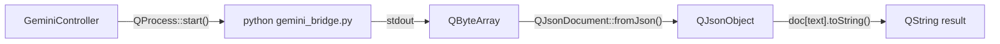
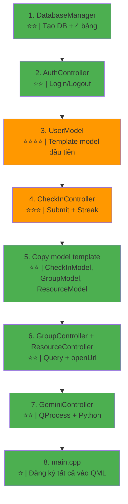

# 🔍 Phân Tích Độ Phức Tạp Code C++ Trong Dự Án

## Kết Luận Nhanh

> [!NOTE]
> Code C++ trong dự án này ở mức **TRUNG BÌNH** (Intermediate). Không có thuật toán phức tạp — chủ yếu là **CRUD database** + **expose data cho QML** + **1 HTTP client**. Phần khó nhất là hiểu cách `QAbstractListModel` hoạt động.

### Bảng Tổng Hợp Độ Khó

| Class | Độ khó | ~Dòng code | Khái niệm Qt cần biết |
|---|:---:|:---:|---|
| [DatabaseManager](file:///F:/Project_BTL/english-mastery-hub/core/databasemanager.h#6-14) | ⭐⭐ Dễ | 80-120 | `QSqlDatabase`, `QSqlQuery` |
| [AuthController](file:///F:/Project_BTL/english-mastery-hub/controllers/authcontroller.h#6-14) | ⭐⭐ Dễ | 60-80 | `Q_INVOKABLE`, signal/slot |
| `CheckInController` | ⭐⭐⭐ TB | 80-120 | Signal, `QDate`, logic streak |
| `GroupController` | ⭐⭐ Dễ | 50-70 | Query aggregate (SUM, GROUP BY) |
| `ResourceController` | ⭐ Rất dễ | 30-50 | `QDesktopServices::openUrl()` |
| `GeminiController` | ⭐⭐ Dễ | 60-80 | `QProcess`, `QJsonDocument` |
| Models (×4) | ⭐⭐⭐⭐ Khó nhất | 80-100/mỗi | `QAbstractListModel`, `roleNames()` |

**Tổng ước tính: ~700-900 dòng C++** (không tính comments)

---

## 1. DatabaseManager — ⭐⭐ Dễ

### Nhiệm vụ:
- Mở/tạo file SQLite (`database.db`)
- Tạo 4 bảng (users, groups, check_ins, resources)
- Cung cấp hàm helper chạy query

### Code minh họa đầy đủ:

```cpp
// core/databasemanager.h
#include <QObject>
#include <QSqlDatabase>
#include <QSqlQuery>
#include <QSqlError>

class DatabaseManager : public QObject {
    Q_OBJECT
public:
    explicit DatabaseManager(QObject *parent = nullptr);
    bool initialize();          // Mở DB + tạo bảng
    QSqlDatabase& database();   // Trả ref để controller dùng

private:
    QSqlDatabase m_db;
    void createTables();
};
```

```cpp
// core/databasemanager.cpp
#include "databasemanager.h"
#include <QStandardPaths>

bool DatabaseManager::initialize() {
    // Bước 1: Mở kết nối SQLite
    m_db = QSqlDatabase::addDatabase("QSQLITE");
    QString path = QStandardPaths::writableLocation(QStandardPaths::AppDataLocation) + "/database.db";
    m_db.setDatabaseName(path);

    if (!m_db.open()) {
        qCritical() << "Không thể mở DB:" << m_db.lastError().text();
        return false;
    }

    createTables();
    return true;
}

void DatabaseManager::createTables() {
    QSqlQuery q(m_db);

    q.exec("CREATE TABLE IF NOT EXISTS users ("
           "id INTEGER PRIMARY KEY AUTOINCREMENT,"
           "username TEXT UNIQUE NOT NULL,"
           "password TEXT NOT NULL,"
           "display_name TEXT,"
           "avatar_path TEXT,"
           "role TEXT DEFAULT 'member',"
           "level INTEGER DEFAULT 1,"
           "stage TEXT DEFAULT 'Beginner',"
           "current_streak INTEGER DEFAULT 0,"
           "max_streak INTEGER DEFAULT 0,"
           "group_id INTEGER)");

    q.exec("CREATE TABLE IF NOT EXISTS groups ("
           "id INTEGER PRIMARY KEY AUTOINCREMENT,"
           "name TEXT NOT NULL,"
           "cover_image_path TEXT,"
           "leader_id INTEGER,"
           "member_count INTEGER DEFAULT 0)");

    q.exec("CREATE TABLE IF NOT EXISTS check_ins ("
           "id INTEGER PRIMARY KEY AUTOINCREMENT,"
           "user_id INTEGER NOT NULL,"
           "check_in_date DATE NOT NULL,"
           "bookworm_hours REAL DEFAULT 0,"
           "ministory_hours REAL DEFAULT 0,"
           "status TEXT DEFAULT 'completed',"
           "day_number INTEGER,"
           "UNIQUE(user_id, check_in_date))");

    q.exec("CREATE TABLE IF NOT EXISTS resources ("
           "id INTEGER PRIMARY KEY AUTOINCREMENT,"
           "title TEXT NOT NULL,"
           "category TEXT,"
           "source_type TEXT,"
           "source_path TEXT)");
}
```

### Tại sao dễ?
- Chỉ cần biết SQL cơ bản (CREATE, INSERT, SELECT)
- Qt đã wrap hết qua `QSqlQuery` — chỉ cần `exec()` và `value()`
- Không có connection pooling hay transaction phức tạp

---

## 2. AuthController — ⭐⭐ Dễ

```cpp
class AuthController : public QObject {
    Q_OBJECT
    Q_PROPERTY(int currentUserId READ currentUserId NOTIFY userChanged)
    Q_PROPERTY(QString currentUserName READ currentUserName NOTIFY userChanged)
    Q_PROPERTY(bool isAdmin READ isAdmin NOTIFY userChanged)

public:
    explicit AuthController(DatabaseManager *db, QObject *parent = nullptr);

    Q_INVOKABLE bool login(const QString &username, const QString &password);
    Q_INVOKABLE void logout();
    Q_INVOKABLE bool createUser(const QString &user, const QString &pass,
                                 const QString &name, const QString &avatar); // Admin only

signals:
    void loginSuccess();
    void loginFailed(const QString &reason);
    void userChanged();

private:
    DatabaseManager *m_db;
    int m_currentUserId = -1;
    QString m_currentUserName;
    bool m_isAdmin = false;
};
```

### Logic login:
```cpp
bool AuthController::login(const QString &username, const QString &password) {
    QSqlQuery q(m_db->database());
    q.prepare("SELECT id, display_name, role FROM users WHERE username = ? AND password = ?");
    q.addBindValue(username);
    q.addBindValue(password);  // ⚠️ Nên hash mật khẩu trong production

    if (q.exec() && q.next()) {
        m_currentUserId = q.value(0).toInt();
        m_currentUserName = q.value(1).toString();
        m_isAdmin = (q.value(2).toString() == "admin");
        emit userChanged();
        emit loginSuccess();
        return true;
    }
    emit loginFailed("Sai tên đăng nhập hoặc mật khẩu");
    return false;
}
```

### Tại sao dễ?
- Chỉ có SELECT + so sánh
- `Q_INVOKABLE` = hàm gọi được từ QML, không cần hiểu MOC sâu

---

## 3. CheckInController — ⭐⭐⭐ Trung bình

### Phần khó nhất: Tính Streak

```cpp
Q_INVOKABLE bool submitCheckIn(double bookwormHours, double ministoryHours) {
    QDate today = QDate::currentDate();

    // 1. INSERT check-in hôm nay
    QSqlQuery q(m_db->database());
    q.prepare("INSERT OR REPLACE INTO check_ins (user_id, check_in_date, bookworm_hours, ministory_hours, status, day_number) "
              "VALUES (?, ?, ?, ?, 'completed', ?)");
    q.addBindValue(m_currentUserId);
    q.addBindValue(today.toString("yyyy-MM-dd"));
    q.addBindValue(bookwormHours);
    q.addBindValue(ministoryHours);
    q.addBindValue(calculateDayNumber(today));
    q.exec();

    // 2. Cập nhật streak
    updateStreak(m_currentUserId);
    emit checkInSuccess();
    return true;
}

void CheckInController::updateStreak(int userId) {
    QSqlQuery q(m_db->database());
    q.prepare("SELECT check_in_date FROM check_ins WHERE user_id = ? AND status = 'completed' ORDER BY check_in_date DESC");
    q.addBindValue(userId);
    q.exec();

    int streak = 0;
    QDate expected = QDate::currentDate();
    while (q.next()) {
        QDate d = q.value(0).toDate();
        if (d == expected) { streak++; expected = expected.addDays(-1); }
        else break;
    }

    // Update user streak
    QSqlQuery u(m_db->database());
    u.prepare("UPDATE users SET current_streak = ?, max_streak = MAX(max_streak, ?) WHERE id = ?");
    u.addBindValue(streak); u.addBindValue(streak); u.addBindValue(userId);
    u.exec();
}
```

### Tại sao trung bình?
- Logic tính streak cần suy nghĩ (loop ngược qua ngày)
- Phải xử lý edge case (check-in trùng ngày, bỏ lỡ ngày)
- Nhưng vẫn chỉ là SQL + vòng lặp — không có algorithm phức tạp

---

## 4. GeminiController — ⭐⭐ Dễ (Cập Nhật: Python Bridge)

### Tại sao dễ hơn trước?
- Logic gọi API **đã chuyển sang Python** (`gemini_bridge.py`) — C++ chỉ cần gọi `QProcess`
- Không cần xử lý HTTP, không cần hiểu async networking
- Chỉ cần parse 1 JSON đơn giản từ stdout (`{"ok": true, "text": "..."}`) 

### Khái niệm cần biết:



Code đã được trình bày đầy đủ trong [project_overview.md — Mục 8.4](file:///f:/Project_BTL/project_overview.md).

---

## 5. QAbstractListModel — ⭐⭐⭐⭐ Phần Khó Nhất

### Tại sao khó?
- Phải override **3 hàm ảo**: `rowCount()`, `data()`, `roleNames()`
- Phải hiểu **Role system** của Qt (mỗi cột dữ liệu = 1 role)
- Phải gọi `beginResetModel()` / `endResetModel()` khi thay đổi dữ liệu

### Template mẫu (copy cho mọi model):

```cpp
// models/usermodel.h
class UserModel : public QAbstractListModel {
    Q_OBJECT
public:
    enum Roles {
        IdRole = Qt::UserRole + 1,
        NameRole,
        AvatarRole,
        StreakRole,
        StatusRole
    };

    explicit UserModel(DatabaseManager *db, QObject *parent = nullptr);

    int rowCount(const QModelIndex &parent = QModelIndex()) const override {
        return m_data.count();
    }

    QVariant data(const QModelIndex &index, int role) const override {
        if (!index.isValid()) return {};
        const auto &item = m_data[index.row()];
        switch (role) {
            case IdRole:     return item.id;
            case NameRole:   return item.name;
            case AvatarRole: return item.avatar;
            case StreakRole:  return item.streak;
            case StatusRole: return item.status;
        }
        return {};
    }

    QHash<int, QByteArray> roleNames() const override {
        return {
            {IdRole, "userId"},
            {NameRole, "displayName"},
            {AvatarRole, "avatarPath"},
            {StreakRole, "streak"},
            {StatusRole, "wantedStatus"}
        };
    }

    Q_INVOKABLE void refresh() {
        beginResetModel();
        m_data.clear();
        QSqlQuery q(m_db->database());
        q.exec("SELECT id, display_name, avatar_path, current_streak FROM users");
        while (q.next()) {
            m_data.append({q.value(0).toInt(), q.value(1).toString(),
                           q.value(2).toString(), q.value(3).toInt(), ""});
        }
        endResetModel();
    }

private:
    struct UserData { int id; QString name; QString avatar; int streak; QString status; };
    QList<UserData> m_data;
    DatabaseManager *m_db;
};
```

### Trick: Dùng trong QML

```qml
// roleNames() quyết định tên property dùng trong QML delegate
ListView {
    model: userModel
    delegate: Text { text: model.displayName + " - Streak: " + model.streak }
    //                       ↑ "displayName" = tên role trong QHash
}
```

> [!TIP]
> **Mẹo:** Viết 1 model hoàn chỉnh trước (UserModel), sau đó copy template cho CheckInModel, GroupModel, ResourceModel — chỉ đổi fields và query SQL.

---

## 6. Tổng Kết: Các Bước Thực Hiện C++ Theo Thứ Tự



| Bước | Thời gian ước tính |
|---|---|
| DatabaseManager | 1-2 giờ |
| AuthController | 1 giờ |
| UserModel (template) | 2-3 giờ (lần đầu) |
| CheckInController + streak | 2 giờ |
| Copy 3 model còn lại | 1-2 giờ |
| GroupController + ResourceController | 1 giờ |
| GeminiController | 1-2 giờ |
| main.cpp đăng ký | 30 phút |
| **Tổng** | **~10-15 giờ** |

> [!IMPORTANT]
> **Kết luận:** C++ trong dự án này **KHÔNG CÓ** thuật toán phức tạp (không sort, không graph, không DP). Toàn bộ là **CRUD + Signal/Slot + 1 HTTP client**. Phần thử thách duy nhất là lần đầu tiên viết `QAbstractListModel` — nhưng sau khi hiểu thì copy/paste cho các model còn lại.
