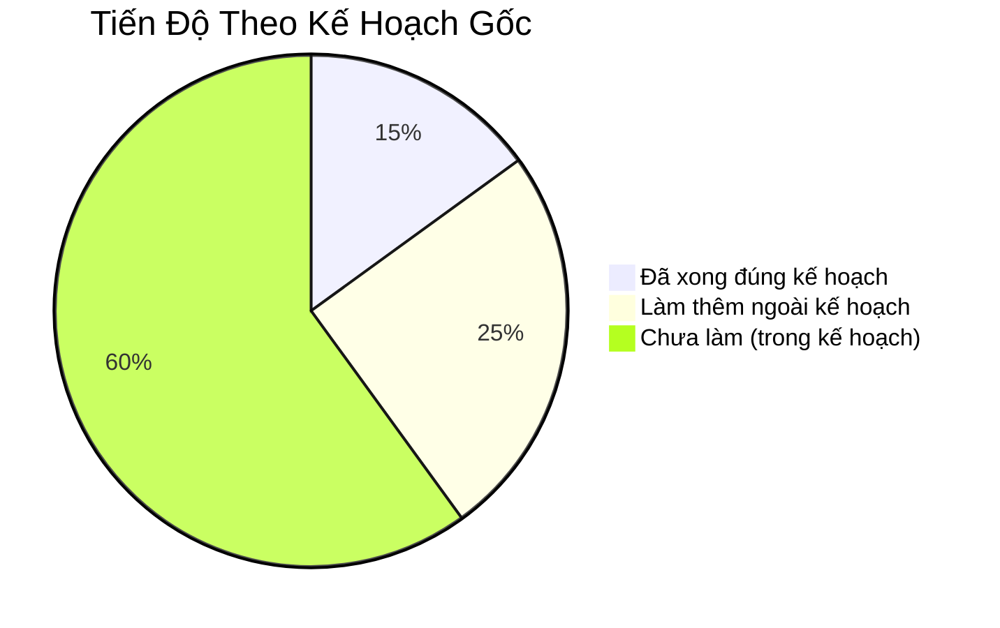
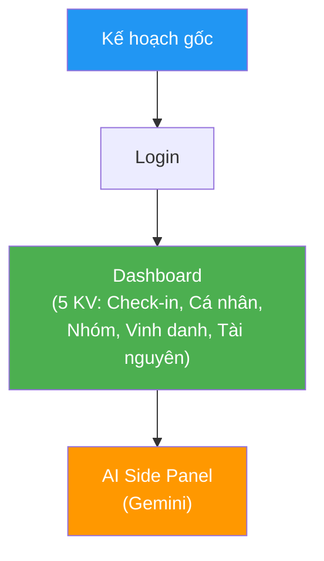
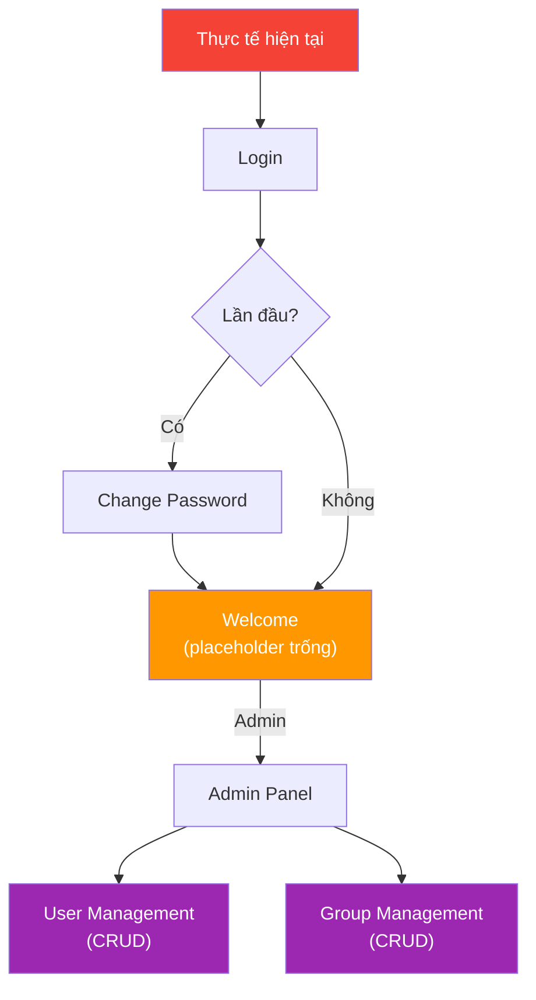

# 📋 Báo Cáo Chệch Hướng — Kế Hoạch Gốc vs Thực Tế

## Tóm Tắt 1 Câu

> Dự án đã **bỏ qua toàn bộ Dashboard 5 KV** (phần cốt lõi) để xây **Admin Panel** (quản lý user/group) — một tính năng **không hề có trong kế hoạch gốc**.

---

## 1. Tổng Quan So Sánh



| Chỉ số | Giá trị |
|---|---|
| Hoàn thành đúng kế hoạch | **~15%** (DB + Auth + Login) |
| Làm thêm ngoài kế hoạch | **~25%** (Admin Panel, CRUD, Avatar, ChangePass, Mocks) |
| Còn thiếu so với kế hoạch | **~60%** (Dashboard, Models, Controllers, AI, Charts) |

---

## 2. Bảng So Sánh Chi Tiết — File Theo File

### ✅ Đúng kế hoạch & đã hoàn thành

| File | Kế hoạch gốc | Thực tế | Khác biệt |
|---|---|---|---|
| `databasemanager.h/cpp` | 4 bảng: `users`, `groups`, `check_ins`, `resources` | **6 bảng**: thêm `app_settings`, `activity_log` | Thêm 2 bảng mới; đổi tên cột (xem mục 3) |
| `authcontroller.h/cpp` | `login()`, `logout()`, `createUser()` | `login()`, `logout()`, `changePassword()` | Bỏ `createUser()`, thêm `changePassword()` + `mustChangePassword` |
| `LoginView.qml` | Dark theme, centered form | Light theme, basic form | **Chưa áp dụng dark theme** |
| `Main.qml` | StackView: Login → Dashboard | StackView: Login → ChangePass → Welcome → AdminPanel | Thêm 2 route, **chưa có route Dashboard** |
| `main.cpp` | Đăng ký tất cả controllers + models | Chỉ đăng ký `realAuthController` | Thiếu 90% context properties |

### ⭐ Ngoài kế hoạch (đã làm nhưng KHÔNG có trong bản gốc)

| File | Dòng code | Mô tả |
|---|:---:|---|
| `ChangePasswordView.qml` | 85 | Buộc đổi pass lần đầu đăng nhập |
| `WelcomeView.qml` | 64 | Trang chào tạm — **thay thế Dashboard** |
| `AdminPanelView.qml` | 55 | TabBar admin: quản lý User + Group |
| `UserManagementPage.qml` | 300 | CRUD user đầy đủ: tạo/sửa/xoá/reset pass + avatar |
| `GroupManagementPage.qml` | 230 | CRUD group: tạo/sửa/xoá + chọn leader |
| `AvatarUploader.qml` | 82 | FileDialog + preview ảnh đại diện |
| `MockAuthController.qml` | 71 | Giả lập auth để dev UI không cần DB |
| `MockAdminUserController.qml` | 102 | Giả lập CRUD user trong RAM |
| `MockAdminGroupController.qml` | 54 | Giả lập CRUD group trong RAM |

> [!WARNING]
> **9 file trên (tổng ~1043 dòng)** không nằm trong kế hoạch gốc nào của A, B, hay C. Đây là effort đáng kể bị "lệch hướng" khỏi mục tiêu chính.

### ❌ Trong kế hoạch nhưng CHƯA LÀM

| File cần có | Ai chịu trách nhiệm | Mục đích |
|---|:---:|---|
| `models/usermodel.h/cpp` | A | QAbstractListModel cho GridView |
| `models/checkinmodel.h/cpp` | A | Data cho Calendar + Charts |
| `models/groupmodel.h/cpp` | A | Data cho Group Carousel |
| `models/resourcemodel.h/cpp` | A | Data cho Resource Library |
| `controllers/checkincontroller.h/cpp` | A | Submit check-in + streak logic |
| `controllers/groupcontroller.h/cpp` | A | Tổng giờ nhóm + chart data |
| `controllers/resourcecontroller.h/cpp` | A | Mở link/file |
| `DashboardView.qml` | B | Layout 5 KV chính |
| `components/CheckInPopup.qml` | B | Popup check-in hàng ngày |
| `components/WantedBoard.qml` | B | Bảng truy nã |
| `components/PersonalZone.qml` | B | Calendar + Charts cá nhân |
| `components/GroupCarousel.qml` | B | Horizontal ListView nhóm |
| `components/GroupCharts.qml` | B | Bar + Line charts nhóm |
| `components/TopPerformerBoard.qml` | B | Bục vinh danh Top 3 |
| `components/ResourceLibrary.qml` | B | Kho tài nguyên |
| `scripts/gemini_bridge.py` | C | Python bridge gọi Gemini API |
| `core/geminicontroller.h/cpp` | C | QProcess bridge C++ → Python |
| `AiDrawer.qml` | C | FAB + Side Panel AI |

---

## 3. Schema DB — Thay Đổi Cụ Thể

| Điểm | Kế hoạch gốc | Thực tế |
|---|---|---|
| Tên bảng check-in | `check_ins` | `checkins` |
| Cột ngày | `check_in_date` | `checkin_date` |
| Cột trạng thái | `status` (completed/missed) | **Không có** cột `status` |
| Cột `day_number` | Có (1-25) | **Không có** |
| Mật khẩu | Plain text | SHA-256 hash + salt |
| Cột `must_change_password` | Không có | ✅ Có (INTEGER) |
| Bảng `app_settings` | Không có | ✅ Có (key/value store) |
| Bảng `activity_log` | Không có | ✅ Có (audit trail) |
| Cột resources | `source_type` / `source_path` | `kind` / `target` + `description` |
| Cột groups | `cover_image_path` / `member_count` | `cover_path` / **bỏ `member_count`** |

---

## 4. Luồng Navigation — Kế Hoạch vs Thực Tế

````carousel

<!-- slide -->

````

---

## 5. Nguyên Nhân Chệch Hướng (Phân Tích)

| # | Nguyên nhân | Bằng chứng |
|---|---|---|
| 1 | **Ưu tiên Admin trước User** | Xây CRUD user/group (admin panel) trước khi xây dashboard cho member |
| 2 | **Thêm security không cần thiết** | `must_change_password`, SHA-256 hash+salt — quá mức cho dự án BTL |
| 3 | **Xây mock system phức tạp** | 3 mock controllers (~227 dòng) — hữu ích nhưng tốn thời gian |
| 4 | **Bỏ qua phần core** | Dashboard 5 KV, Charts, Calendar, AI — chưa bắt đầu |

---

## 6. Mức Độ Nghiêm Trọng

```
Kế hoạch gốc:  [████████████████████████████████████████] 100%
Đã làm đúng:   [██████                                  ]  15%
Làm ngoài KH:  [██████████                              ]  25%  ← effort lãng phí
Còn thiếu:     [████████████████████████                ]  60%  ← phần cốt lõi
```

> [!CAUTION]
> **Phần "cốt lõi" chưa được bắt đầu:** Dashboard 5 Khu Vực là **mục đích chính** của ứng dụng (Check-in, Bảng Truy Nã, Calendar, Charts, Vinh Danh, Tài Nguyên, AI). Tất cả đều ở mức 0%. Admin Panel tuy hữu ích nhưng là tính năng phụ trợ, không phải sản phẩm demo chính.

---

## 7. Khuyến Nghị

1. **Dừng mở rộng Admin Panel** — Đã đủ dùng, không cần thêm tính năng
2. **Quay lại kế hoạch gốc** — Ưu tiên Models (A) → Dashboard KV (B) → AI (C)
3. **Giữ lại những gì đã làm** — Admin Panel, Mock system, hash password đều có giá trị, chỉ cần không đầu tư thêm
4. **Cập nhật kế hoạch C** — Ghi nhận schema DB đã thay đổi trước khi C viết code AI
