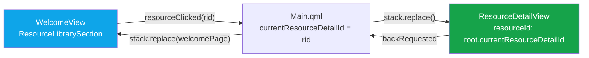
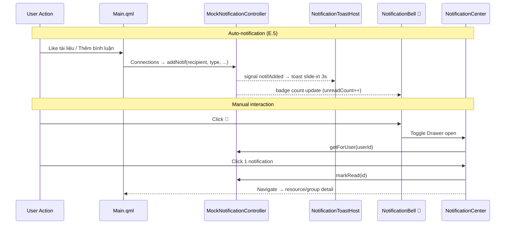
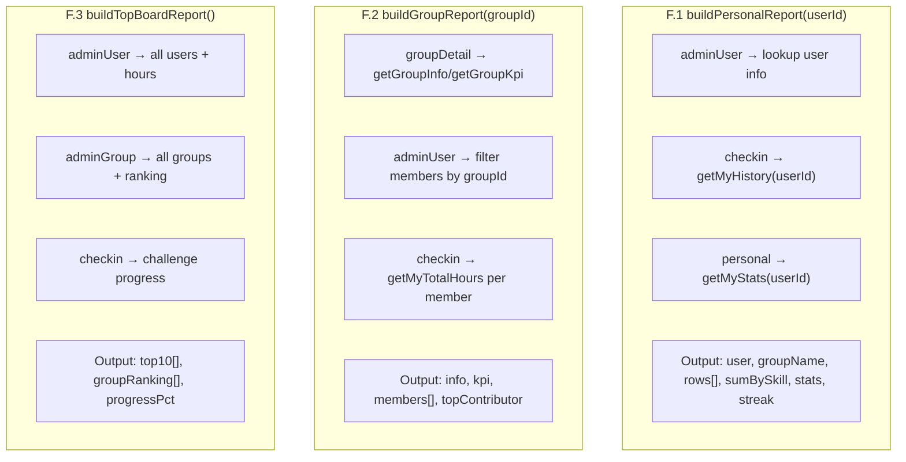

# 📋 PHÂN TÍCH CHI TIẾT MILESTONE 7, 8, 9, 10
## Dự án English Mastery Hub — Nguồn: Folder Train_AI + Code thực tế

---

## TỔNG QUAN

| Milestone | Tên | Tài liệu nguồn | Files mới | Tổng dòng code |
|:---:|---|---|:---:|:---:|
| **M7** | Resource Detail | AI_2.7 → AI_4.2 | 4 | **1.295** |
| **M8** | Notification System | AI_4.3 → AI_4.5 | 4 | **816** |
| **M9** | PDF Export | AI_4.6 → AI_4.8 | 4 | **1.297** |
| **M10** | AI + Theme | AI_4.9 + Người C | 2 | **197** |
| | | **Tổng** | **14** | **3.605** |

---

## M7 — RESOURCE DETAIL (Kho Tài Liệu Chi Tiết)

### Tài liệu nguồn
- **AI_2.7**: Tạo `MockResourceController` + `ResourceLibrarySection` (danh sách tài liệu)
- **AI_2.8**: Dialog Thêm/Xóa tài liệu, phân quyền admin/leader
- **AI_4.0**: Tạo `ResourceDetailView` skeleton + routing
- **AI_4.1**: Like/Unlike + Uploader card + URL preview (bước D.3)
- **AI_4.2**: `ResourceCommentsSection` — bình luận (bước D.4, kết thúc M7)

### Quy trình từng bước (D.1 → D.5)

| Bước | Tài liệu | Nội dung | File tạo/sửa |
|:---:|---|---|---|
| D.1 | AI_2.7 | Data model + CRUD resource | `MockResourceController.qml` (MỚI) |
| D.1b | AI_2.7 | Danh sách + filter + card delegate | `ResourceLibrarySection.qml` (MỚI) |
| D.2 | AI_4.0 | Skeleton detail view + StackView routing | `ResourceDetailView.qml` (MỚI) + sửa `Main.qml`, `WelcomeView.qml` |
| D.3 | AI_4.1 | URL preview, uploader card, Like button | Sửa `ResourceDetailView.qml` |
| D.4 | AI_4.2 | Comment section (list + add + delete) | `ResourceCommentsSection.qml` (MỚI) + sửa `CMakeLists.txt` |

### Data Model (từ MockResourceController.qml — 185 dòng)

```
Resource {
    id: int, title: string, type: "pdf"|"video"|"audio"|"link",
    url: string, uploadedBy: string, addedAt: string,
    groupId: int  // 0 = chung, >0 = nhóm cụ thể
}

Comment { id, resourceId, userId, username, text, createdAt }
Like    { resourceId, userId }
```

**API Controller** (10 functions):

| Function | Mô tả |
|---|---|
| `getAll()` | Lấy tất cả tài liệu |
| `getByType(type)` | Lọc theo loại (pdf/video/audio/link) |
| `getResourceById(id)` | Chi tiết 1 tài liệu |
| `addResource(title, type, url, uploader, groupId)` | Thêm mới |
| `deleteResource(id)` | Xóa tài liệu |
| `getComments(resourceId)` | Lấy bình luận |
| `addComment(resourceId, userId, username, text)` | Thêm bình luận |
| `deleteComment(commentId)` | Xóa bình luận |
| `toggleLike(resourceId, userId)` | Like/Unlike |
| `getLikeCount(resourceId)` / `hasLiked(resourceId, userId)` | Đếm like |

### Kiến trúc routing (từ AI_4.0)



### Vai trò Người C trong M7

> Người C thêm **nút "📝 AI Tóm Tắt"** vào `ResourceLibrarySection` — gọi `gemini.summarizeResource()` để AI phân tích nội dung tài liệu. Đây là feature M7 duy nhất do Người C thực hiện, kết hợp M7 (Resource) với AI layer.

---

## M8 — NOTIFICATION SYSTEM (Hệ Thống Thông Báo)

### Tài liệu nguồn
- **AI_4.3**: Tạo `MockNotificationController` (E.1) + `NotificationToastHost` (E.2) + phím tắt Ctrl+T
- **AI_4.4**: Gộp E.3 + E.4 — `NotificationBell` + `NotificationCenter` cùng lúc
- **AI_4.5**: Wire events thật (comment/like → auto notif) + fix bug MockResourceController thiếu `getResourceById`

### Quy trình từng bước (E.1 → E.5)

| Bước | Tài liệu | Nội dung | File tạo/sửa |
|:---:|---|---|---|
| E.1 | AI_4.3 | Data model + CRUD notification | `MockNotificationController.qml` (MỚI) |
| E.2 | AI_4.3 | Toast popup (slide-in 3s) + Ctrl+T test | `NotificationToastHost.qml` (MỚI) + sửa `Main.qml` |
| E.3 | AI_4.4 | Chuông 🔔 + badge đỏ trên header | `NotificationBell.qml` (MỚI) |
| E.4 | AI_4.4 | Drawer side panel danh sách notif | `NotificationCenter.qml` (MỚI) + sửa `CMakeLists.txt` |
| E.5 | AI_4.5 | Auto-notif khi comment/like | Sửa `Main.qml` (Connections block) |

### Data Model (từ MockNotificationController.qml — 193 dòng)

```
Notification {
    id: int, userId: int (recipient),
    type: "comment"|"like"|"group_added"|"wanted_offer"|"streak",
    title: string, body: string,
    link: "resource:1"|"group:2"|"",  // navigate target
    refId: int, isRead: bool, createdAt: ISO string
}
```

**API Controller** (12 functions):

| Function | Mô tả |
|---|---|
| `addNotif(userId, type, title, body, link, refId)` | Tạo notif + auto FIFO prune (max 100/user) |
| `getForUser(uid)` | Lấy notifs theo user, sort mới nhất |
| `getUnreadCount(uid)` | Đếm chưa đọc (cho badge) |
| `getById(id)` | Lấy 1 notif |
| `markRead(id)` | Đánh dấu đã đọc |
| `markAllRead(uid)` | Đánh dấu tất cả đã đọc |
| `deleteNotif(id)` | Xóa 1 notif |
| `clearForUser(uid)` | Xóa tất cả của user |
| `typeIcon(t)` | Emoji theo loại (💬❤️👥🤝🔥) |
| `typeColor(t)` | Màu hex theo loại |
| `relativeTime(iso)` | Format "5 phút trước", "2 ngày trước" |

### Luồng hoạt động (từ AI_4.3 → AI_4.5)



### Seed Data (5 notifications)

| ID | User | Type | Nội dung |
|:---:|---|---|---|
| 1 | admin | comment | @tien bình luận về "Cambridge B1" |
| 2 | admin | like | @duy thích "Cambridge B1" |
| 3 | admin | streak | 🔥 Streak 7 ngày! |
| 4 | tien | group_added | Admin thêm vào "Nhóm Alpha" |
| 5 | tien | comment | @admin trả lời bình luận |

---

## M9 — PDF EXPORT (Xuất Báo Cáo PDF)

### Tài liệu nguồn
- **AI_4.6**: F.1 — PdfPreviewDialog (báo cáo cá nhân) + nút trong PersonalView
- **AI_4.7**: F.2 — PdfPreviewGroupDialog (báo cáo nhóm) + nút trong GroupDetailView
- **AI_4.8**: F.3 — PdfPreviewTopBoardDialog (báo cáo workspace) + wire vào Main.qml

### Quy trình từng bước (F.1 → F.3)

| Bước | Tài liệu | Nội dung | File tạo/sửa |
|:---:|---|---|---|
| F.0 | AI_4.6 | Controller mock + data aggregation | `MockPdfExporter.qml` (MỚI) |
| F.1 | AI_4.6 | Dialog preview cá nhân (stats + skills + history) | `PdfPreviewDialog.qml` (MỚI) + sửa `PersonalView.qml` |
| F.2 | AI_4.7 | Dialog preview nhóm (KPI + ranking + top contributor) | `PdfPreviewGroupDialog.qml` (MỚI) + sửa `GroupDetailView.qml` |
| F.3 | AI_4.8 | Dialog preview workspace (top 10 + groups + progress) | `PdfPreviewTopBoardDialog.qml` (MỚI) + sửa `Main.qml`, `CMakeLists.txt` |

### Data Model (từ MockPdfExporter.qml — 250 dòng)

**3 hàm build report** — tổng hợp data từ nhiều controller:



### Phân quyền xuất PDF

| Báo cáo | File dialog | Ai thấy nút? | Vị trí nút |
|---|---|---|---|
| F.1 Cá nhân | `PdfPreviewDialog.qml` (317 dòng) | Mọi user (cho chính mình) | PersonalView header → "📄 Xuất PDF" |
| F.2 Nhóm | `PdfPreviewGroupDialog.qml` (299 dòng) | Admin + Leader nhóm đó | GroupDetailView header → "📄 Xuất PDF" |
| F.3 Workspace | `PdfPreviewTopBoardDialog.qml` (431 dòng) | Admin only | AdminPanelView → "📊 Báo cáo tổng" |

### Export Flow (mock mode)

```
User click "📄 Xuất PDF"
  → Controller.buildXxxReport() → aggregate data
  → Dialog mở (preview layout giống PDF)
  → User click "💾 Lưu PDF"
  → Controller.exportXxx() → fake path "C:/Reports/xxx.pdf"
  → Signal exportCompleted → Toast "Đã lưu thành công!"
```

> **Lưu ý:** Hiện tại chỉ tạo **fake path** (mock). Phase B sẽ thay bằng `QtPrintSupport` để xuất file PDF thật.

---

## M10 — AI INTEGRATION + THEME (Tích hợp AI + Giao diện)

### Tài liệu nguồn
- **AI_4.9**: Kiểm tra tổng thể M1-M9, tạo `MockThemeController` (chưa wire), thêm `MockGeminiController`
- **person_c_guide.md**: Hướng dẫn chi tiết 3 ngày cho Người C (Python bridge + C++ controller + QML drawer)
- **Báo cáo Người C**: Thực tế đã thực hiện (mock AI + dark mode + bug fixes)

### Quy trình phát triển (trích từ tài liệu)

#### Kế hoạch gốc (person_c_guide.md — 3 ngày)

| Ngày | Việc | File |
|:---:|---|---|
| 1 | Python bridge → test 4 mode | `scripts/gemini_bridge.py` |
| 2 | C++ controller (QProcess → Python) | `core/geminicontroller.h/.cpp` |
| 3 | QML drawer (FAB + side panel) | `AiDrawer.qml` |

#### Thực tế Người C đã làm (thay đổi so với kế hoạch)

| Kế hoạch | Thực tế | Lý do |
|---|---|---|
| `AiDrawer.qml` (drawer side panel) | **Inline buttons** trong từng section | UX tốt hơn — nút AI nằm ngay context cần dùng |
| SDK cũ `google.generativeai` | **SDK mới** `google.genai` v1.73.1 | Đã cài sẵn trên máy, API mới hơn |
| Prompt đơn giản | **Structured prompts** với format 3 phần | Kết quả AI chất lượng hơn |
| Chưa có dark mode | **Hoàn thiện M10 Theme** — wire 8 components | MockThemeController đã tạo nhưng chưa dùng |

### MockGeminiController.qml (103 dòng) — 4 chế độ AI

| Mode | Function | Số responses | UI trigger |
|---|---|:---:|---|
| `warn` | `generateWarning(name, days)` | 3 | WantedBoard → "🤖 Nhắc" |
| `analyze` | `analyzeProgress(dataJson)` | 2 | PersonalView → "📊 AI Phân Tích" |
| `summarize` | `summarizeResource(content)` | 2 | ResourceLibrary → "📝 AI" |
| `chat` | `askGemini(prompt)` | 1 | Chat tự do |

### MockThemeController.qml (94 dòng) — Color Design System

| Token | Light | Dark |
|---|---|---|
| `pageBg` | `#f8fafc` | `#0f172a` |
| `surface` | `#ffffff` | `#1e293b` |
| `text` | `#0f172a` | `#f1f5f9` |
| `textMuted` | `#64748b` | `#cbd5e1` |
| `primary` | `#0ea5e9` | `#38bdf8` |
| `danger` | `#dc2626` | `#f87171` |

### Chuỗi truyền theme (thực tế trong code)

```
Main.qml (MockThemeController {id: mockTheme})
  ├── LoginView          → theme text colors
  ├── WelcomeView        → toggle button 🌙/☀️, header bg
  │     ├── EditableCallout ×2  → dark callout bg
  │     ├── CheckinSection      → dark status card
  │     ├── WantedBoardSection  → dark wanted cards
  │     ├── CheckedInTodaySection → dark member cards
  │     └── ResourceLibrarySection → dark resource cards
  └── PersonalView       → dark stat cards, header
```

---

## TỔNG HỢP: FILES TRONG DỰ ÁN THEO MILESTONE

| # | File | M7 | M8 | M9 | M10 | Dòng |
|:---:|---|:---:|:---:|:---:|:---:|:---:|
| 1 | [MockResourceController.qml](file:///f:/Project_BTL/english-mastery-hub/MockResourceController.qml) | ✅ | | | | 185 |
| 2 | [ResourceLibrarySection.qml](file:///f:/Project_BTL/english-mastery-hub/ResourceLibrarySection.qml) | ✅ | | | 🌙 | 335 |
| 3 | [ResourceDetailView.qml](file:///f:/Project_BTL/english-mastery-hub/ResourceDetailView.qml) | ✅ | | | | 469 |
| 4 | [ResourceCommentsSection.qml](file:///f:/Project_BTL/english-mastery-hub/ResourceCommentsSection.qml) | ✅ | | | | 306 |
| 5 | [MockNotificationController.qml](file:///f:/Project_BTL/english-mastery-hub/MockNotificationController.qml) | | ✅ | | | 193 |
| 6 | [NotificationToastHost.qml](file:///f:/Project_BTL/english-mastery-hub/NotificationToastHost.qml) | | ✅ | | | 198 |
| 7 | [NotificationBell.qml](file:///f:/Project_BTL/english-mastery-hub/NotificationBell.qml) | | ✅ | | | 106 |
| 8 | [NotificationCenter.qml](file:///f:/Project_BTL/english-mastery-hub/NotificationCenter.qml) | | ✅ | | | 319 |
| 9 | [MockPdfExporter.qml](file:///f:/Project_BTL/english-mastery-hub/MockPdfExporter.qml) | | | ✅ | | 250 |
| 10 | [PdfPreviewDialog.qml](file:///f:/Project_BTL/english-mastery-hub/PdfPreviewDialog.qml) | | | ✅ | | 317 |
| 11 | [PdfPreviewGroupDialog.qml](file:///f:/Project_BTL/english-mastery-hub/PdfPreviewGroupDialog.qml) | | | ✅ | | 299 |
| 12 | [PdfPreviewTopBoardDialog.qml](file:///f:/Project_BTL/english-mastery-hub/PdfPreviewTopBoardDialog.qml) | | | ✅ | | 431 |
| 13 | [MockGeminiController.qml](file:///f:/Project_BTL/english-mastery-hub/MockGeminiController.qml) | | | | ✅🤖 | 103 |
| 14 | [MockThemeController.qml](file:///f:/Project_BTL/english-mastery-hub/MockThemeController.qml) | | | | ✅🌙 | 94 |
| 15 | [gemini_bridge.py](file:///f:/Project_BTL/english-mastery-hub/scripts/gemini_bridge.py) | | | | ✅🤖 | 66 |
| 16 | [geminicontroller.h](file:///f:/Project_BTL/english-mastery-hub/core/geminicontroller.h) | | | | ✅🤖 | ~30 |
| 17 | [geminicontroller.cpp](file:///f:/Project_BTL/english-mastery-hub/core/geminicontroller.cpp) | | | | ✅🤖 | ~55 |

> ✅ = tạo mới, 🌙 = Người C sửa thêm theme, 🤖 = Người C tạo/sửa AI
