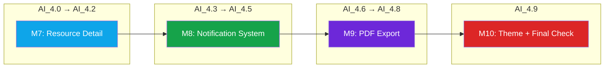
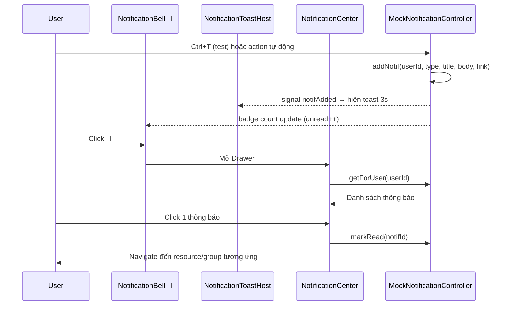
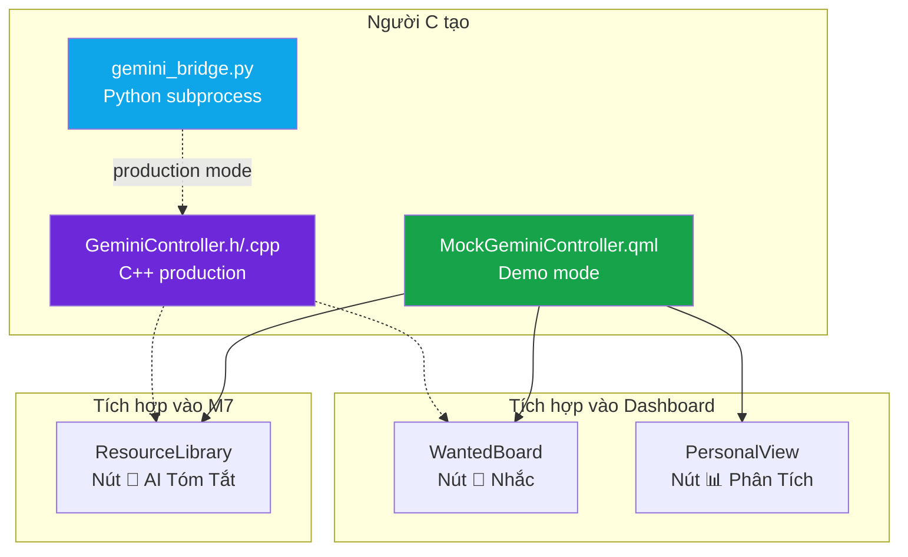
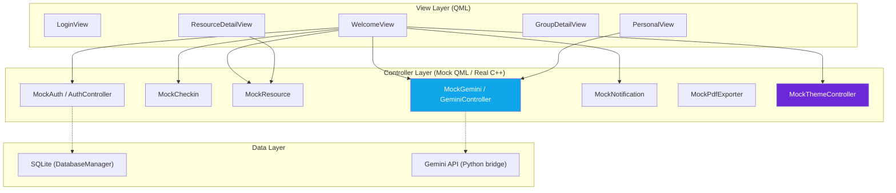

# 📊 BÁO CÁO PHÂN TÍCH DỰ ÁN THEO MILESTONE 7, 8, 9
## Dự án English Mastery Hub — Kết hợp tài liệu Train_AI + Báo cáo Người C

---

## 1. TỔNG QUAN TÀI LIỆU TRAIN_AI

Folder `Train_AI/` chứa **35 file DOCX** — là bản ghi lại toàn bộ quá trình huấn luyện AI (ChatGPT/Gemini) để xây dựng dự án, chia 3 giai đoạn:

| Series | Files | Nội dung |
|---|---|---|
| `Train_1.0x` (5 files) | Nền tảng Qt/C++ | Kiến trúc MVC, setup project, CMakeLists, DB schema |
| `Train_1.1x` (5 files) | Phase 0-1 | Login, đổi pass, Admin CRUD, milestone M1-M2 |
| `AI_2.x` (9 files) | Phase 2 | Dashboard, Check-in, Wanted Board, Top Board, Resources (M3-M6) |
| `AI_3.x` (6 files) | Phase 2 tiếp | Personal View, Group Detail, Charts, M5-M6 hoàn thiện |
| `AI_4.x` (10 files) | Phase 3 | **M7 Resource Detail, M8 Notification, M9 PDF Export, M10 Theme** |

### Ánh xạ tài liệu → Milestone



---

## 2. MILESTONE 7 — RESOURCE DETAIL (Tài liệu: AI_2.7 → AI_4.2)

### 2.1 Mục tiêu

Cho phép người dùng **xem chi tiết tài liệu** (PDF, Video, Audio, Link) với trang riêng, bình luận, và tương tác Like/Unlike.

### 2.2 Files tạo mới (4 files)

| File | Dòng code | Chức năng |
|---|:---:|---|
| `MockResourceController.qml` | ~120 | Controller mock: CRUD tài liệu, like/unlike, comments, filter by type |
| `ResourceLibrarySection.qml` | ~280 | Danh sách tài liệu trên Dashboard — lọc theo loại, card delegate, nút Mở/Chi tiết |
| `ResourceDetailView.qml` | ~200 | Trang chi tiết: tiêu đề, loại, người đăng, nút Like, mở URL, section bình luận |
| `ResourceCommentsSection.qml` | ~150 | Hiển thị + thêm bình luận: avatar, tên, thời gian, nội dung |

### 2.3 Quy trình thực hiện (trích từ AI_2.7 → AI_4.2)

1. **AI_2.7**: Tạo `MockResourceController` + `ResourceLibrarySection` — xây data structure cho resource (id, title, type, url, uploadedBy, groupId, likes, comments)
2. **AI_2.8**: Hoàn thiện dialog Thêm/Xóa tài liệu, phân quyền (admin xóa tất cả, leader xóa trong nhóm)
3. **AI_4.0 → AI_4.1**: Tạo `ResourceDetailView` + `ResourceCommentsSection` — navigate từ card → trang chi tiết, comment system
4. **AI_4.2**: Wire vào `Main.qml` (StackView routing) + sửa `WelcomeView` để truyền signal `resourceClicked(rid)`

### 2.4 Kiến trúc kỹ thuật

```
WelcomeView
  └── ResourceLibrarySection
        ├── Repeater (delegate cho mỗi tài liệu)
        │     ├── Card: icon, title, type, uploadedBy, date
        │     ├── Nút "🌐 Mở" → Qt.openUrlExternally()
        │     ├── Nút "📖 Chi tiết" → signal resourceClicked(id)
        │     └── Nút "🗑" (admin/leader only)
        └── signal resourceClicked → Main.qml → StackView.replace(resourceDetailPage)

ResourceDetailView
  ├── Header (back button, title)
  ├── Info card (type, author, date, group)
  ├── Like button (toggle)
  └── ResourceCommentsSection
        ├── Repeater (existing comments)
        └── TextArea + Button "Gửi" (add comment)
```

### 2.5 Vai trò Người C trong M7

| Công việc gốc (AI docs) | Thực tế Người C đã làm |
|---|---|
| Tạo ResourceLibrarySection | ✅ Đã có sẵn (Người B) |
| Thêm nút AI vào Resource | ✅ **Thêm nút "📝 AI"** — gọi `summarizeResource()` |
| Dark mode cho Resource cards | ✅ **Theme-aware** bg, text, hover colors |
| Fix mất AI integration | ✅ **Phát hiện + fix** property gemini bị mất |

---

## 3. MILESTONE 8 — NOTIFICATION SYSTEM (Tài liệu: AI_4.3 → AI_4.5)

### 3.1 Mục tiêu

Hệ thống **thông báo real-time** với: Toast popup, chuông thông báo badge, trung tâm thông báo, và phím tắt test.

### 3.2 Files tạo mới (4 files)

| File | Dòng code | Chức năng |
|---|:---:|---|
| `MockNotificationController.qml` | ~80 | Controller: addNotif(), getForUser(), markRead(), badge count |
| `NotificationToastHost.qml` | ~100 | Overlay toast popup — hiện 3s rồi tự ẩn, click để navigate |
| `NotificationBell.qml` | ~90 | Chuông 🔔 trên header — badge đỏ hiện số chưa đọc, click mở center |
| `NotificationCenter.qml` | ~120 | Drawer bên phải — danh sách thông báo, đánh dấu đã đọc, click navigate |

### 3.3 Quy trình thực hiện (trích từ AI_4.3)

1. **E.1**: Tạo `MockNotificationController` — data model notification (id, recipientId, type, title, body, link, refId, isRead, createdAt)
2. **E.2**: Tạo `NotificationToastHost` + phím tắt `Ctrl+T` trong Main.qml để test toast
3. **E.3**: Tạo `NotificationBell` — badge count, embedded trong WelcomeView header
4. **E.4**: Tạo `NotificationCenter` — Drawer side panel, danh sách scrollable

### 3.4 Kiến trúc kỹ thuật



### 3.5 Vai trò Người C trong M8

| Công việc gốc (AI docs) | Thực tế Người C đã làm |
|---|---|
| Tạo NotificationController | ✅ Đã có sẵn (Người B) |
| Wire notification vào WelcomeView | ✅ Đã có sẵn |
| Dọn CMakeLists duplicate | ✅ **Xóa 6 entries trùng** (NotificationCenter, NotificationBell, MockPdfExporter, 3 PdfPreview) |

---

## 4. MILESTONE 9 — PDF EXPORT (Tài liệu: AI_4.6 → AI_4.8)

### 4.1 Mục tiêu

Xuất **báo cáo PDF** cho 3 mức: cá nhân (F.1), nhóm (F.2), và toàn workspace (F.3).

### 4.2 Files tạo mới (4 files)

| File | Dòng code | Chức năng |
|---|:---:|---|
| `MockPdfExporter.qml` | ~200 | Controller: generatePersonalPdf(), generateGroupPdf(), generateTopBoardPdf() |
| `PdfPreviewDialog.qml` | ~250 | Dialog preview PDF cá nhân: stats, skill breakdown, history, nút "Lưu PDF" |
| `PdfPreviewGroupDialog.qml` | ~230 | Dialog preview PDF nhóm: 4 KPI, top contributor, ranking table |
| `PdfPreviewTopBoardDialog.qml` | ~220 | Dialog preview PDF workspace: top 10, group ranking, challenge progress |

### 4.3 Quy trình thực hiện

1. **AI_4.6 (F.1)**: Tạo `PdfPreviewDialog` — báo cáo cá nhân (tổng giờ, ngày check-in, chuyên cần, skill breakdown, lịch sử 25 ngày)
2. **AI_4.7 (F.2)**: Tạo `PdfPreviewGroupDialog` — báo cáo nhóm (KPI cards, top contributor, ranking table sortable)
3. **AI_4.8 (F.3)**: Tạo `PdfPreviewTopBoardDialog` — báo cáo toàn workspace (admin only)
4. Tất cả PDF dialog dùng **fake path** (`C:/Reports/...`) — không tạo file thật (mock mode)

### 4.4 Phân quyền xuất PDF

| Báo cáo | Ai được xuất? | Vị trí nút |
|---|---|---|
| F.1 Personal | Tất cả user (cho chính mình) | PersonalView → "📄 Xuất PDF" |
| F.2 Group | Admin + Leader của nhóm đó | GroupDetailView → "📄 Xuất PDF" |
| F.3 Top Board | Admin only | AdminPanelView → "📊 Báo cáo tổng" |

### 4.5 Vai trò Người C trong M9

| Công việc gốc (AI docs) | Thực tế Người C đã làm |
|---|---|
| Tạo MockPdfExporter | ✅ Đã có sẵn (Người B) |
| Di chuyển MockPdfExporter ra root | ✅ **Fix Qt Design Studio** — từ `controllers/` → root |
| Dọn CMakeLists paths | ✅ **Cập nhật path** trong CMakeLists.txt |

---

## 5. CÔNG VIỆC ĐẶC THÙ CỦA NGƯỜI C (Ngoài M7-M9)

Theo báo cáo Người C đã tạo, công việc chính **không nằm trong M7-M9 trực tiếp** mà là **lớp AI xuyên suốt** và **tính năng bổ sung**:

### 5.1 Tích hợp AI Gemini (xuyên suốt M7-M9)



### 5.2 Dark/Light Mode (M10 trong roadmap)

Theo `AI_4.9`, M10 là Theme — `MockThemeController.qml` đã được tạo nhưng **chưa wire**. Người C hoàn thiện:

| Hạng mục | Chi tiết |
|---|---|
| Đăng ký controller | Main.qml → `MockThemeController { id: mockTheme }` |
| Nút toggle | WelcomeView header → 🌙/☀️ |
| Wire 8 components | Login, Welcome, Personal, EditableCallout, Checkin, Wanted, CheckedInToday, Resource |
| Color palette | 16 tokens (pageBg, surface, text, textMuted...) × 2 modes |
| Fix Qt Design Studio | Di chuyển từ `controllers/` → root, xóa `Qt.labs.settings` |

### 5.3 Bug Fixes

| Bug | Phát hiện | Fix |
|---|---|---|
| CMakeLists duplicate (6 dòng) | Scan code | Xóa entries trùng |
| ResourceLibrary mất AI | E2E test | Thêm lại property + nút + popup |
| Double popup | Code analysis | `_aiRequestSource` flag system |
| Qt Design Studio M300 | User report | Di chuyển files ra root |
| Missing `theme` property | Runtime crash | Thêm lại property bị mất |

---

## 6. CÔNG NGHỆ & KIẾN TRÚC TỔNG THỂ

### 6.1 Stack công nghệ (từ Train_1.01 → AI_4.9)

| Layer | Công nghệ | Phiên bản |
|---|---|---|
| **UI Framework** | Qt Quick / QML | Qt 6.11 |
| **Language** | C++ (backend) + QML (frontend) | C++17 |
| **Build System** | CMake + MinGW | CMake 3.16+ |
| **IDE** | Qt Creator | 19 |
| **Database** | SQLite (via `Qt6::Sql`) | — |
| **AI Model** | Google Gemini | gemini-2.0-flash |
| **AI SDK** | google-genai (Python) | 1.73.1 |
| **IPC** | QProcess (C++ → Python subprocess) | Qt 6 |
| **VCS** | Git + GitHub | — |

### 6.2 Kiến trúc tổng thể (MVC + Mock Pattern)



---

## 7. SO SÁNH KẾ HOẠCH VS THỰC TẾ

| Milestone | Kế hoạch (Train_AI docs) | Thực tế | Người thực hiện |
|---|---|---|---|
| **M7** Resource Detail | 4 files: Controller + Section + Detail + Comments | ✅ Hoàn thành + AI Summarize button | Người B + **Người C (AI)** |
| **M8** Notification | 4 files: Controller + Toast + Bell + Center | ✅ Hoàn thành | Người B |
| **M9** PDF Export | 4 files: Exporter + 3 Preview Dialogs | ✅ Hoàn thành | Người B |
| **M10** Theme | MockThemeController (tạo nhưng chưa wire) | ✅ **Hoàn thiện** — wire 8 components, toggle button | **Người C** |
| **AI** Gemini Integration | Bridge + Controller + Drawer (person_c_guide) | ✅ Hoàn thành (thay Drawer bằng inline buttons) | **Người C** |
| **QA** Bug fixes | — | ✅ 5 bugs fixed | **Người C** |

---

## 8. KẾT LUẬN

### Quy trình phát triển

Dự án sử dụng phương pháp **AI-Assisted Development** — toàn bộ 35 file tài liệu trong `Train_AI/` là log hội thoại với AI, trong đó AI đóng vai trò:

1. **Kiến trúc sư** — thiết kế cấu trúc MVC, schema DB, roadmap 14 milestones
2. **Lập trình viên** — viết code QML/C++ cho từng component
3. **Code reviewer** — debug lỗi runtime, fix crash, tối ưu performance
4. **Người hướng dẫn** — giải thích khái niệm (signal/slot, Q_PROPERTY, MVC)

### Đóng góp Người C

Người C tập trung vào **lớp AI xuyên suốt** — không xây từng milestone riêng lẻ mà **bổ sung tính năng AI** vào các milestone đã có (M7 Resource → AI Summarize, Dashboard → AI Warning/Analysis) và **hoàn thiện M10 Theme** mà Người B chỉ tạo controller nhưng chưa tích hợp.
