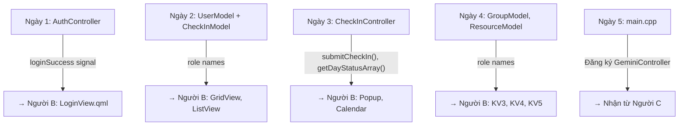

# 🔧 Người A — Backend C++ Engineer

## Vai Trò Tổng Quan

Bạn chịu trách nhiệm **toàn bộ lớp dữ liệu** và **logic nghiệp vụ C++**: Database, Controllers, Models, và `main.cpp`. Bạn là người **xây nền móng** để Người B (Frontend) có data để hiển thị và Người C (AI) có controller để đăng ký.

---

## Kiến Thức Cần Học Trước

### 1. Qt SQL Module (~1 giờ học)
- **`QSqlDatabase`**: Mở kết nối SQLite, `addDatabase("QSQLITE")`, `setDatabaseName()`, `open()`
- **`QSqlQuery`**: `prepare()`, `addBindValue()`, `exec()`, `next()`, `value()`
- **Tài liệu**: [Qt SQL Programming](https://doc.qt.io/qt-6/sql-programming.html)

### 2. Signal/Slot + Q_INVOKABLE (~30 phút)
- `Q_INVOKABLE`: đánh dấu hàm C++ để QML gọi được
- `Q_PROPERTY`: expose thuộc tính C++ cho QML bind
- `signals` + `emit`: phát tín hiệu từ C++ → QML lắng nghe

### 3. QAbstractListModel (~2 giờ — phần khó nhất)
- Override 3 hàm: `rowCount()`, `data()`, `roleNames()`
- Enum `Roles` cho mỗi cột dữ liệu
- `beginResetModel()` / `endResetModel()` khi refresh data
- **Tài liệu**: [QAbstractListModel](https://doc.qt.io/qt-6/qabstractlistmodel.html)

> [!TIP]
> Viết `UserModel` hoàn chỉnh trước → sau đó **copy template** cho 3 model còn lại (chỉ đổi fields + query SQL).

---

## Lịch Trình Chi Tiết 6 Ngày

### Ngày 1: DatabaseManager + AuthController

#### Nhiệm vụ 1.1 — `core/databasemanager.h/cpp`
```cpp
class DatabaseManager : public QObject {
    Q_OBJECT
public:
    explicit DatabaseManager(QObject *parent = nullptr);
    bool initialize();          // Mở DB + tạo 4 bảng
    QSqlDatabase& database();   // Trả ref cho controller dùng
private:
    QSqlDatabase m_db;
    void createTables();        // CREATE TABLE IF NOT EXISTS ...
};
```

**Việc cần làm:**
- `initialize()`: mở file `database.db` tại `QStandardPaths::AppDataLocation`
- `createTables()`: tạo 4 bảng — `users`, `groups`, `check_ins`, `resources`
- Schema chi tiết xem [project_overview.md — Mục 6](file:///f:/Project_BTL/project_overview.md)
- Seed 1 admin account mặc định: `admin / admin123`

#### Nhiệm vụ 1.2 — `controllers/authcontroller.h/cpp`
```cpp
class AuthController : public QObject {
    Q_OBJECT
    Q_PROPERTY(int currentUserId READ currentUserId NOTIFY userChanged)
    Q_PROPERTY(QString currentUserName READ currentUserName NOTIFY userChanged)
    Q_PROPERTY(bool isAdmin READ isAdmin NOTIFY userChanged)
public:
    Q_INVOKABLE bool login(const QString &username, const QString &password);
    Q_INVOKABLE void logout();
    Q_INVOKABLE bool createUser(const QString &user, const QString &pass,
                                 const QString &name, const QString &avatar);
signals:
    void loginSuccess();
    void loginFailed(const QString &reason);
    void userChanged();
};
```

**Việc cần làm:**
- `login()`: SELECT từ `users` WHERE username + password → emit `loginSuccess` hoặc `loginFailed`
- `logout()`: reset `m_currentUserId = -1` → emit `userChanged`
- `createUser()`: INSERT INTO users (chỉ admin mới gọi được)

#### 🔗 Giao cho Người B:
> Cuối ngày 1, báo Người B rằng `authController.login()` đã sẵn sàng, kèm danh sách signals: `loginSuccess()`, `loginFailed(reason)`. Người B sẽ dùng trong `LoginView.qml`.

---

### Ngày 2: UserModel + CheckInModel

#### Nhiệm vụ 2.1 — `models/usermodel.h/cpp` (Template đầu tiên)

Đây là model **quan trọng nhất** — viết kỹ ở đây, sau đó các model khác chỉ cần copy template.

```cpp
class UserModel : public QAbstractListModel {
    Q_OBJECT
public:
    enum Roles {
        IdRole = Qt::UserRole + 1,
        NameRole, AvatarRole, StreakRole, StatusRole, GroupIdRole
    };

    int rowCount(const QModelIndex &parent = QModelIndex()) const override;
    QVariant data(const QModelIndex &index, int role) const override;
    QHash<int, QByteArray> roleNames() const override;

    Q_INVOKABLE void refresh();                    // Load tất cả users
    Q_INVOKABLE void loadWantedList();             // Chỉ load người chưa check-in
    Q_INVOKABLE void loadTop3Bookworm();           // Top 3 theo giờ Bookworm
    Q_INVOKABLE void loadTop3Ministory();          // Top 3 theo giờ Ministory

private:
    struct UserData { int id; QString name; QString avatar; int streak; QString status; int groupId; };
    QList<UserData> m_data;
    DatabaseManager *m_db;
};
```

**Các query SQL quan trọng:**
```sql
-- Wanted list (chưa check-in hôm nay)
SELECT u.* FROM users u
WHERE u.id NOT IN (
    SELECT user_id FROM check_ins WHERE check_in_date = date('now')
);

-- Top 3 Bookworm
SELECT u.display_name, u.avatar_path, SUM(c.bookworm_hours) as total
FROM users u JOIN check_ins c ON u.id = c.user_id
GROUP BY u.id ORDER BY total DESC LIMIT 3;
```

#### Nhiệm vụ 2.2 — `models/checkinmodel.h/cpp`
- Copy template từ `UserModel`
- Roles: `DateRole`, `BookwormRole`, `MinistoryRole`, `StatusRole`, `DayNumberRole`
- `Q_INVOKABLE void loadByUser(int userId)` → SELECT * FROM check_ins WHERE user_id = ?

#### 🔗 Giao cho Người B:
> Báo Người B danh sách **role names** chính xác (VD: `"displayName"`, `"avatarPath"`, `"streak"`) để bind trong QML delegate. Người B cần `model.displayName`, `model.streak` trong GridView/ListView.

---

### Ngày 3: CheckInController + Logic Streak

#### Nhiệm vụ 3.1 — `controllers/checkincontroller.h/cpp`

```cpp
class CheckInController : public QObject {
    Q_OBJECT
public:
    Q_INVOKABLE bool submitCheckIn(double bookwormHours, double ministoryHours);
    Q_INVOKABLE QVariantList getDayStatusArray(int userId);  // Cho calendar grid
signals:
    void checkInSuccess();
    void checkInFailed(const QString &error);
};
```

**Logic tính streak** (phần phức tạp nhất):
```cpp
void updateStreak(int userId) {
    QSqlQuery q(m_db->database());
    q.prepare("SELECT check_in_date FROM check_ins "
              "WHERE user_id = ? AND status = 'completed' "
              "ORDER BY check_in_date DESC");
    q.addBindValue(userId);
    q.exec();

    int streak = 0;
    QDate expected = QDate::currentDate();
    while (q.next()) {
        QDate d = q.value(0).toDate();
        if (d == expected) { streak++; expected = expected.addDays(-1); }
        else break;
    }
    // UPDATE users SET current_streak = ?, max_streak = MAX(max_streak, ?)
}
```

**`getDayStatusArray()`** — trả mảng 25 phần tử cho calendar grid:
```cpp
QVariantList getDayStatusArray(int userId) {
    QVariantList result;
    for (int day = 1; day <= 25; day++) {
        // Query check_ins WHERE user_id = ? AND day_number = ?
        // → "done" | "missed" | "future"
        result.append(status);
    }
    return result;
}
```

#### 🔗 Giao cho Người B:
> Báo Người B 2 thứ: (1) `submitCheckIn()` trả `bool`, phát signal `checkInSuccess` khi OK — dùng trong Popup. (2) `getDayStatusArray()` trả QVariantList — dùng cho calendar grid.

---

### Ngày 4: GroupModel + GroupController + ResourceModel + ResourceController

#### Nhiệm vụ 4.1 — `models/groupmodel.h/cpp`
- Copy template từ UserModel
- Roles: `NameRole`, `CoverImageRole`, `LeaderNameRole`, `MemberCountRole`, `TotalBookwormRole`, `TotalMinistoryRole`
- Query: JOIN groups + users + check_ins, dùng `SUM()` và `GROUP BY`

#### Nhiệm vụ 4.2 — `controllers/groupcontroller.h/cpp`
- `Q_INVOKABLE QVariantList getGroupNames()` → cho BarChart axis
- `Q_INVOKABLE QVariantList getGroupBookwormTotals()` → data cho BarChart

#### Nhiệm vụ 4.3 — `models/resourcemodel.h/cpp`
- Roles: `TitleRole`, `CategoryRole`, `SourceTypeRole`, `SourcePathRole`
- `Q_INVOKABLE void loadByCategory(const QString &category)`

#### Nhiệm vụ 4.4 — `controllers/resourcecontroller.h/cpp` (rất đơn giản)
```cpp
Q_INVOKABLE void openResource(const QString &path, const QString &type) {
    if (type == "link") QDesktopServices::openUrl(QUrl(path));
    else QDesktopServices::openUrl(QUrl::fromLocalFile(path));
}
```

#### 🔗 Giao cho Người B:
> Giao đầy đủ role names cho GroupModel và ResourceModel. Người B đang chờ để hoàn thành KV3, KV4, KV5.

---

### Ngày 5: main.cpp + Seed Data

#### Nhiệm vụ 5.1 — Cập nhật `main.cpp`
```cpp
int main(int argc, char *argv[]) {
    QGuiApplication app(argc, argv);
    QQmlApplicationEngine engine;

    // 1. Database
    DatabaseManager dbManager;
    dbManager.initialize();

    // 2. Controllers
    AuthController authCtrl(&dbManager);
    CheckInController checkInCtrl(&dbManager, &authCtrl);
    GroupController groupCtrl(&dbManager);
    ResourceController resourceCtrl;

    // 3. Models
    UserModel userModel(&dbManager);
    CheckInModel checkInModel(&dbManager);
    GroupModel groupModel(&dbManager);
    ResourceModel resourceModel(&dbManager);

    // 4. GeminiController (từ Người C)
    GeminiController geminiCtrl;

    // 5. Đăng ký vào QML context
    auto *ctx = engine.rootContext();
    ctx->setContextProperty("authController", &authCtrl);
    ctx->setContextProperty("checkInController", &checkInCtrl);
    ctx->setContextProperty("groupController", &groupCtrl);
    ctx->setContextProperty("resourceController", &resourceCtrl);
    ctx->setContextProperty("userModel", &userModel);
    ctx->setContextProperty("checkInModel", &checkInModel);
    ctx->setContextProperty("groupModel", &groupModel);
    ctx->setContextProperty("resourceModel", &resourceModel);
    ctx->setContextProperty("geminiController", &geminiCtrl);

    engine.loadFromModule("EnglishMasteryHub", "Main");
    return QCoreApplication::exec();
}
```

#### Nhiệm vụ 5.2 — Seed Data mẫu
Tạo file `seed.sql` hoặc hàm `seedData()` trong DatabaseManager:
```sql
-- 3 nhóm
INSERT INTO groups (name, cover_image_path, leader_id, member_count) VALUES
('Gà Trống KFC', 'assets/images/kfc.png', 1, 5),
('Siêu Trùm Tắm Mưa', 'assets/images/rain.png', 2, 4),
('Ếch Ộp', 'assets/images/frog.png', 3, 4);

-- 10-12 users phân vào 3 nhóm
-- 5-7 ngày check-in mẫu cho mỗi user (mix completed/missed)
```

#### 🔗 Giao cho cả nhóm:
> Sau khi seed data, tất cả đều có dữ liệu để test. Báo Người B và C.

---

### Ngày 6: Fix Bug + Hỗ Trợ Integration

- Fix bug từ testing của Người C
- Tối ưu SQL queries nếu chậm
- Hỗ trợ Người B debug kết nối QML ↔ C++
- Review code toàn bộ nhóm

---

## Sơ Đồ Những Gì Bạn Giao Cho Người Khác


