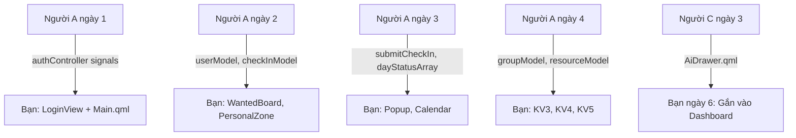

# 🎨 Người B — Frontend QML Designer

## Vai Trò Tổng Quan

Bạn chịu trách nhiệm **toàn bộ giao diện người dùng QML** — từ Login đến 5 khu vực Dashboard. Bạn sẽ **nhận data models và signals từ Người A** để bind vào UI, và **nhận AI Drawer từ Người C** để gắn vào Dashboard.

---

## Kiến Thức Cần Học Trước

### 1. QML Cơ Bản (~2 giờ)
- **Layout**: `RowLayout`, `ColumnLayout`, `GridLayout` — cách dùng `Layout.fillWidth`, `Layout.preferredWidth`
- **Controls**: `Button`, `TextField`, `SpinBox`, `TabBar`, `SwipeView`, `StackView`, `Popup`, `Drawer`
- **Tài liệu**: [Qt Quick Controls](https://doc.qt.io/qt-6/qtquickcontrols-index.html)

### 2. Data Binding QML ↔ C++ (~1 giờ)
- Truy cập property C++ từ QML: `authController.currentUserName`
- Dùng model trong `ListView`/`GridView`: `model.displayName`, `model.streak`
- Lắng nghe signal: `Connections { target: authController; function onLoginSuccess() { ... } }`

### 3. Qt Charts (~1 giờ)
- `ChartView`, `LineSeries`, `BarSeries`
- `ValueAxis`, `BarCategoryAxis`
- **Tài liệu**: [Qt Charts QML Types](https://doc.qt.io/qt-6/qtcharts-qmlmodule.html)

### 4. Thiết Kế Dark Theme
- Bảng màu chính: nền `#0f0f23` / `#1a1a2e`, card `#16213e`, accent `#e94560`, text `white` / `#aaa`
- Gradient neon: `#00f5a0` → `#00d9f5`
- Bo góc: `radius: 8-16`, shadow nhẹ qua `MultiEffect`

---

## Lịch Trình Chi Tiết 6 Ngày

### Ngày 1: LoginView.qml + Main.qml + CMakeLists.txt

#### Nhiệm vụ 1.1 — Cập nhật CMakeLists.txt
Thêm các Qt module và khai báo file QML/Source. Xem chi tiết tại [project_overview.md — Mục 12](file:///f:/Project_BTL/project_overview.md).

#### Nhiệm vụ 1.2 — `LoginView.qml`

**Yêu cầu thiết kế:**
- Nền dark theme (`#1a1a2e`), `ColumnLayout` centered, width 350
- Title `"🔥 English Mastery Hub"` màu `#e94560`, bold 28px
- 2 `TextField` (username + password) với nền `#16213e`, border `#0f3460`, radius 8
- Password: `echoMode: TextInput.Password`
- `Button` "Đăng Nhập" nền `#e94560`, text trắng bold
- `Text` error ẩn, hiện khi login thất bại

**Kết nối với Người A:**
```qml
Button {
    text: "Đăng Nhập"
    onClicked: {
        // authController.login() là Q_INVOKABLE từ Người A
        var ok = authController.login(usernameField.text, passwordField.text)
        if (!ok) errorText.text = "Sai tên đăng nhập hoặc mật khẩu"
    }
}
```

Code đầy đủ xem [qt_design_guide.md — Bước 1](file:///f:/Project_BTL/qt_design_guide.md).

#### Nhiệm vụ 1.3 — `Main.qml`

**Yêu cầu:**
- `ApplicationWindow` 1280×800, title "English Mastery Hub", nền `#0f0f23`
- `StackView` với `initialItem: loginPage`
- Lắng nghe signal `loginSuccess` → `stackView.replace(dashboardPage)`

```qml
Connections {
    target: authController  // ← Từ Người A
    function onLoginSuccess() { stackView.replace(dashboardPage) }
}
```

Code đầy đủ xem [qt_design_guide.md — Bước 2](file:///f:/Project_BTL/qt_design_guide.md).

---

### Ngày 2: DashboardView.qml + KV1 (Check-in + Wanted Board)

#### Nhiệm vụ 2.1 — `DashboardView.qml`

Dùng **SwipeView + TabBar** (5 tab):
```qml
TabBar {
    TabButton { text: "📋 Check-in" }
    TabButton { text: "👤 Cá nhân" }
    TabButton { text: "👥 Nhóm" }
    TabButton { text: "🏆 Vinh danh" }
    TabButton { text: "📚 Tài nguyên" }
}
SwipeView {
    currentIndex: tabBar.currentIndex
    CheckInZone {}      // KV1
    PersonalZone {}     // KV2
    GroupZone {}        // KV3
    TopPerformerZone {} // KV4
    ResourceZone {}    // KV5
}
```

#### Nhiệm vụ 2.2 — `components/CheckInPopup.qml`

- `Popup { modal: true; dim: true }` centered, 400×300
- 2 `SpinBox` (Bookworm + Ministory hours), cho phép x10 để nhập 0.5h
- Nút "Xác nhận" gọi `checkInController.submit()` ← **từ Người A (ngày 3)**

> [!IMPORTANT]
> Ngày 2, Người A chưa xong CheckInController. Bạn hãy **viết UI trước**, gọi hàm placeholder. Ngày 3 sẽ kết nối khi Người A giao.

#### Nhiệm vụ 2.3 — `components/WantedBoard.qml`

- `GridView { cellWidth: 220; cellHeight: 180; model: wantedModel }`
- Delegate: `Rectangle` bo góc 12, nền `#16213e`, border `#e94560`
- Bên trong: Avatar bo tròn (`MultiEffect` mask) + Tên bold + Cảnh báo + Streak

**Kết nối với Người A:**
```qml
GridView {
    model: userModel  // ← QAbstractListModel từ Người A (ngày 2)
    delegate: Rectangle {
        Text { text: model.displayName }     // roleNames từ Người A
        Text { text: "🔥 Streak: " + model.streak }
    }
}
```

Code đầy đủ xem [qt_design_guide.md — Bước 4](file:///f:/Project_BTL/qt_design_guide.md).

---

### Ngày 3: KV2 — Không Gian Cá Nhân

#### Nhiệm vụ 3.1 — `components/PersonalZone.qml`

**Layout chính: `RowLayout` chia 2 nửa đều**

**Nửa trái — Profile + Calendar:**
- Avatar bo tròn 80×80 + Tên bold + Streak
- `ProgressBar` custom gradient (`#00f5a0` → `#00d9f5`), hiện `X / 25 ngày`
- Calendar Grid: `GridLayout { columns: 7 }` (T2→CN) + 1 ô offset + 25 ô ngày
  - Màu theo status: xanh `#4CAF50` (done), đỏ `#F44336` (missed), xám `#333` (future)

**Kết nối với Người A:**
```qml
// dayStatusArray là QVariantList từ CheckInController (ngày 3 Người A)
Repeater { model: 25
    Rectangle {
        color: dayStatusArray[index] === "done" ? "#4CAF50"
             : dayStatusArray[index] === "missed" ? "#F44336"
             : "#333"
        Text { text: index + 1 }
    }
}
```

**Nửa phải — 2 Line Charts:**
```qml
import QtCharts
ChartView {
    title: "📘 Giờ Học Bookworm"
    backgroundColor: "transparent"; titleColor: "white"
    LineSeries { name: "Bookworm"; color: "#00d9f5"; width: 2
        // Append data từ checkInModel (Người A)
    }
}
```

Code đầy đủ xem [qt_design_guide.md — Bước 5](file:///f:/Project_BTL/qt_design_guide.md).

---

### Ngày 4: KV3 (Nhóm) + KV4 (Vinh Danh)

#### Nhiệm vụ 4.1 — `components/GroupCarousel.qml`
- `ListView { orientation: Horizontal; model: groupModel }`
- Delegate: Card 200×180, nửa trên là ảnh bìa, nửa dưới là tên nhóm + trưởng nhóm + số thành viên

#### Nhiệm vụ 4.2 — `components/GroupCharts.qml`
- `BarSeries` cho Bookworm (theo nhóm) + `LineSeries` cho Ministory
- Axis categories từ `groupController.getGroupNames()` ← **Người A ngày 4**

#### Nhiệm vụ 4.3 — `components/TopPerformerBoard.qml`
- `RowLayout` tỷ lệ 6:4 (Bookworm : Ministory)
- Top 1: kích thước lớn hơn, viền vàng `#ffd700`, nền `#2d1b69`
- Top 2: viền bạc `#c0c0c0` | Top 3: viền đồng `#cd7f32`
- Huy chương tròn (Rectangle radius 18) với số 1/2/3

Code đầy đủ xem [qt_design_guide.md — Bước 6, 7](file:///f:/Project_BTL/qt_design_guide.md).

---

### Ngày 5: KV5 (Tài Nguyên) + Dark Theme + Hover Effects

#### Nhiệm vụ 5.1 — `components/ResourceLibrary.qml`
- `ScrollView` chứa `ColumnLayout` — 3 section (Bookworm, Quy định, Ministory)
- Card tài liệu: hover effect (`MouseArea { hoverEnabled: true }` → đổi màu nền)
- Icon phân loại: 🌐 (link) | 📎 (file)
- Nút "Mở" gọi `resourceController.openResource()` ← **Người A ngày 4**

#### Nhiệm vụ 5.2 — Polish Dark Theme
- Kiểm tra tất cả text color = white/`#aaa` trên nền tối
- TabBar styling: nền `#1a1a2e`, tab active highlight `#e94560`
- Transition animations: `Behavior on color { ColorAnimation { duration: 200 } }`

Code đầy đủ xem [qt_design_guide.md — Bước 8](file:///f:/Project_BTL/qt_design_guide.md).

---

### Ngày 6: Tích Hợp AI Panel + Polish Cuối

#### Nhiệm vụ 6.1 — Nhận `AiDrawer.qml` từ Người C
- Người C giao `components/AiDrawer.qml` (FAB button + Drawer)
- Bạn gắn vào `DashboardView.qml`:
```qml
// Thêm vào cuối DashboardView.qml
AiDrawer { id: aiDrawer }
```

#### Nhiệm vụ 6.2 — Polish cuối
- Responsive: test nhiều kích thước cửa sổ
- Micro-animations: `scale` khi hover button, `opacity` khi transition
- Review toàn bộ spacing, padding, font sizes

---

## Sơ Đồ Nhận Từ Người Khác



> [!TIP]
> **Mẹo làm việc song song:** Nếu Người A chưa xong model, bạn vẫn có thể viết UI với **mock data** bằng `ListModel` tạm trong QML:
> ```qml
> ListModel {
>     id: mockUsers
>     ListElement { displayName: "Nguyễn Văn A"; streak: 5; avatarPath: "" }
>     ListElement { displayName: "Trần Thị B"; streak: 3; avatarPath: "" }
> }
> ```
> Sau đó đổi `model: mockUsers` → `model: userModel` khi Người A giao.
