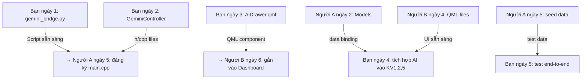

# 🤖 Người C — AI + Integration Specialist

## Vai Trò Tổng Quan

Bạn chịu trách nhiệm **tích hợp Gemini AI** (Python bridge + C++ controller + QML panel) và **testing toàn bộ hệ thống**. Bạn là cầu nối giữa AI và ứng dụng — nhận data từ Người A, giao UI component cho Người B.

---

## Kiến Thức Cần Học Trước

### 1. Python `google-generativeai` SDK (~30 phút)
```bash
pip install google-generativeai
```
```python
import google.generativeai as genai
genai.configure(api_key="YOUR_KEY")
model = genai.GenerativeModel("gemini-pro")
response = model.generate_content("Hello")
print(response.text)
```
- **Tài liệu**: [Gemini API Quickstart](https://ai.google.dev/tutorials/python_quickstart)

### 2. QProcess trong Qt (~30 phút)
- `QProcess::start("python", {"script.py", "--arg", "value"})`
- Signal `finished(int exitCode)` — async
- `readAllStandardOutput()` → `QByteArray` → parse JSON
- **Tài liệu**: [QProcess](https://doc.qt.io/qt-6/qprocess.html)

### 3. QML Cơ Bản (~1 giờ)
- `Drawer` (side panel), `BusyIndicator`, `TextArea`, `MouseArea`
- Data binding: `text: geminiController.lastResponse`
- Xem nhanh [qt_design_guide.md — Bước 9](file:///f:/Project_BTL/qt_design_guide.md)

---

## Lịch Trình Chi Tiết 6 Ngày

### Ngày 1: Python `gemini_bridge.py` + Test Riêng

#### Nhiệm vụ 1.1 — Tạo `scripts/gemini_bridge.py`

```python
# scripts/gemini_bridge.py
import sys, json, argparse
import google.generativeai as genai

def main():
    parser = argparse.ArgumentParser()
    parser.add_argument("--mode", choices=["warn", "analyze", "summarize", "chat"], required=True)
    parser.add_argument("--data", required=True)
    parser.add_argument("--api-key", required=True)
    args = parser.parse_args()

    genai.configure(api_key=args.api_key)
    model = genai.GenerativeModel("gemini-pro")

    prompts = {
        "warn": (
            "Hãy viết 1 lời nhắc nhở hài hước bằng tiếng Việt, "
            "giọng điệu thân thiện nhưng nghiêm khắc, tối đa 2 câu. "
            f"Thông tin: {args.data}"
        ),
        "analyze": (
            "Phân tích tiến độ học tập tiếng Anh dựa trên dữ liệu sau "
            "và đề xuất lộ trình ngày mai (Bookworm + Ministory). "
            f"Dữ liệu: {args.data}"
        ),
        "summarize": (
            "Tóm tắt tài liệu tiếng Anh sau, trích xuất từ vựng khó "
            "và giải thích ngữ pháp quan trọng. "
            f"Nội dung: {args.data}"
        ),
        "chat": args.data,
    }

    try:
        response = model.generate_content(prompts[args.mode])
        print(json.dumps({"ok": True, "text": response.text}, ensure_ascii=False))
    except Exception as e:
        print(json.dumps({"ok": False, "error": str(e)}, ensure_ascii=False))
        sys.exit(1)

if __name__ == "__main__":
    main()
```

#### Nhiệm vụ 1.2 — Test từng mode

```bash
# Test chat
python scripts/gemini_bridge.py --mode chat --data "Hello, how are you?" --api-key YOUR_KEY

# Test warn (KV1)
python scripts/gemini_bridge.py --mode warn --data "Phúc Tiền đã lười biếng 3 ngày" --api-key YOUR_KEY

# Test analyze (KV2)
python scripts/gemini_bridge.py --mode analyze --data '{"bookworm": [1,2,0,3], "ministory": [0.5,1,0,1.5]}' --api-key YOUR_KEY

# Test summarize (KV5)
python scripts/gemini_bridge.py --mode summarize --data "The quick brown fox jumps over the lazy dog..." --api-key YOUR_KEY
```

**Checklist ngày 1:**
- [ ] 4 mode đều trả JSON hợp lệ `{"ok": true, "text": "..."}`
- [ ] Error handling: API key sai → `{"ok": false, "error": "..."}`
- [ ] Timeout: xử lý khi mạng chậm (thêm `timeout` nếu cần)

#### 🔗 Giao cho Người A:
> Báo Người A: script Python đã sẵn sàng tại `scripts/gemini_bridge.py`. Ngày 5 Người A sẽ đăng ký `GeminiController` vào `main.cpp`.

---

### Ngày 2: `GeminiController` (C++ QProcess Bridge)

#### Nhiệm vụ 2.1 — `core/geminicontroller.h`

```cpp
class GeminiController : public QObject {
    Q_OBJECT
    Q_PROPERTY(bool isLoading READ isLoading NOTIFY loadingChanged)
    Q_PROPERTY(QString lastResponse READ lastResponse NOTIFY responseReceived)
public:
    explicit GeminiController(QObject *parent = nullptr);

    Q_INVOKABLE void askGemini(const QString &prompt);
    Q_INVOKABLE void analyzeProgress(const QString &dataJson);
    Q_INVOKABLE void summarizeResource(const QString &content);
    Q_INVOKABLE void generateWarning(const QString &name, int lazyDays);

    bool isLoading() const { return m_isLoading; }
    QString lastResponse() const { return m_lastResponse; }

signals:
    void responseReceived(const QString &text);
    void errorOccurred(const QString &error);
    void loadingChanged();

private:
    void runPythonBridge(const QString &mode, const QString &data);
    QString m_apiKey;
    QString m_lastResponse;
    bool m_isLoading = false;
};
```

#### Nhiệm vụ 2.2 — `core/geminicontroller.cpp`

```cpp
#include "geminicontroller.h"
#include <QProcess>
#include <QJsonDocument>
#include <QJsonObject>
#include <QCoreApplication>

GeminiController::GeminiController(QObject *parent) : QObject(parent) {
    m_apiKey = qEnvironmentVariable("GEMINI_API_KEY");
    if (m_apiKey.isEmpty()) {
        qWarning() << "GEMINI_API_KEY environment variable not set!";
    }
}

void GeminiController::runPythonBridge(const QString &mode, const QString &data) {
    m_isLoading = true;
    emit loadingChanged();

    auto *proc = new QProcess(this);
    QString scriptPath = QCoreApplication::applicationDirPath() + "/scripts/gemini_bridge.py";

    connect(proc, &QProcess::finished, this, [this, proc](int exitCode) {
        m_isLoading = false;
        emit loadingChanged();

        auto output = proc->readAllStandardOutput();
        auto doc = QJsonDocument::fromJson(output).object();

        if (exitCode == 0 && doc["ok"].toBool()) {
            m_lastResponse = doc["text"].toString();
            emit responseReceived(m_lastResponse);
        } else {
            QString err = doc["error"].toString();
            if (err.isEmpty()) err = proc->readAllStandardError();
            emit errorOccurred(err);
        }
        proc->deleteLater();
    });

    proc->start("python", {scriptPath, "--mode", mode, "--data", data, "--api-key", m_apiKey});
}

void GeminiController::askGemini(const QString &prompt) {
    runPythonBridge("chat", prompt);
}
void GeminiController::generateWarning(const QString &name, int lazyDays) {
    runPythonBridge("warn", QString("%1 đã lười biếng %2 ngày không check-in").arg(name).arg(lazyDays));
}
void GeminiController::analyzeProgress(const QString &dataJson) {
    runPythonBridge("analyze", dataJson);
}
void GeminiController::summarizeResource(const QString &content) {
    runPythonBridge("summarize", content);
}
```

**Test:** Viết hàm test đơn giản trong `main.cpp` tạm thời:
```cpp
GeminiController gc;
gc.askGemini("Xin chào");
QObject::connect(&gc, &GeminiController::responseReceived, [](const QString &t) {
    qDebug() << "AI response:" << t;
});
```

#### 🔗 Giao cho Người A:
> Giao file `geminicontroller.h/cpp` để Người A thêm vào CMakeLists.txt SOURCES và đăng ký vào `main.cpp` (ngày 5).

---

### Ngày 3: AI Drawer QML

#### Nhiệm vụ 3.1 — `components/AiDrawer.qml`

```qml
import QtQuick
import QtQuick.Controls
import QtQuick.Layouts

Item {
    // ═══ Floating Action Button ═══
    Rectangle {
        id: aiFab; width: 56; height: 56; radius: 28
        anchors { right: parent.right; bottom: parent.bottom; margins: 20 }
        color: hovered ? "#5a9bf4" : "#4285F4"
        z: 100
        property bool hovered: false

        Text { text: "🤖"; anchors.centerIn: parent; font.pixelSize: 24 }

        MouseArea {
            anchors.fill: parent; hoverEnabled: true
            onEntered: parent.hovered = true
            onExited: parent.hovered = false
            onClicked: aiDrawer.open()
        }

        // Pulse animation
        SequentialAnimation on scale {
            loops: Animation.Infinite
            NumberAnimation { to: 1.05; duration: 1000; easing.type: Easing.InOutSine }
            NumberAnimation { to: 1.0; duration: 1000; easing.type: Easing.InOutSine }
        }
    }

    // ═══ Side Drawer ═══
    Drawer {
        id: aiDrawer; edge: Qt.RightEdge; width: 380
        background: Rectangle { color: "#1a1a2e" }

        ColumnLayout {
            anchors.fill: parent; anchors.margins: 16; spacing: 12

            // Header
            RowLayout {
                Text { text: "🤖 AI Assistant"; color: "white"; font { pixelSize: 20; bold: true }; Layout.fillWidth: true }
                Button { text: "✕"; flat: true; onClicked: aiDrawer.close()
                    contentItem: Text { text: "✕"; color: "#aaa"; font.pixelSize: 16 }
                }
            }

            Rectangle { Layout.fillWidth: true; height: 1; color: "#333" }

            // Response area
            ScrollView {
                Layout.fillWidth: true; Layout.fillHeight: true
                TextArea {
                    text: geminiController.lastResponse  // ← C++ property
                    readOnly: true; wrapMode: TextArea.WordWrap
                    color: "white"; font.pixelSize: 14
                    background: Rectangle { color: "#16213e"; radius: 8 }
                }
            }

            // Loading indicator
            BusyIndicator {
                running: geminiController.isLoading  // ← C++ property
                Layout.alignment: Qt.AlignHCenter
                visible: running
            }

            // Error display
            Text {
                id: errorText; color: "#e94560"; visible: false
                Layout.fillWidth: true; wrapMode: Text.WordWrap
            }

            // Quick actions
            RowLayout { Layout.fillWidth: true; spacing: 8
                Button { text: "📊 Tiến độ"; Layout.fillWidth: true
                    onClicked: geminiController.analyzeProgress(currentUserDataJson)
                }
                Button { text: "📚 Tóm tắt"; Layout.fillWidth: true
                    onClicked: geminiController.summarizeResource(selectedResourceContent)
                }
            }

            // Chat input
            RowLayout { Layout.fillWidth: true
                TextField {
                    id: promptField; Layout.fillWidth: true
                    placeholderText: "Hỏi AI bất cứ điều gì..."
                    color: "white"
                    background: Rectangle { color: "#16213e"; radius: 8; border.color: "#0f3460" }
                    Keys.onReturnPressed: sendButton.clicked()
                }
                Button {
                    id: sendButton; text: "Gửi"
                    onClicked: {
                        if (promptField.text.length > 0) {
                            geminiController.askGemini(promptField.text)
                            promptField.text = ""
                        }
                    }
                }
            }
        }
    }

    // Lắng nghe error signal
    Connections {
        target: geminiController
        function onErrorOccurred(error) {
            errorText.text = "❌ " + error
            errorText.visible = true
        }
        function onResponseReceived() { errorText.visible = false }
    }
}
```

#### 🔗 Giao cho Người B:
> Giao file `components/AiDrawer.qml`. Người B chỉ cần thêm 1 dòng vào `DashboardView.qml`:
> ```qml
> AiDrawer { anchors.fill: parent }
> ```

---

### Ngày 4: Tích Hợp AI Vào 3 Khu Vực

#### Nhiệm vụ 4.1 — KV1: Auto Warning (Bảng Truy Nã)

Thêm vào `WantedBoard.qml` — mỗi thẻ có nút nhỏ gọi AI:
```qml
// Trong delegate của WantedBoard
Button {
    text: "💬 AI nhắc"
    font.pixelSize: 10
    onClicked: geminiController.generateWarning(model.displayName, model.lazyDays)
}
// Hiển thị kết quả trong tooltip hoặc Text bên dưới
Text {
    text: geminiController.lastResponse
    visible: geminiController.lastResponse.length > 0
    color: "#ffa500"; font.pixelSize: 11
    wrapMode: Text.WordWrap
}
```

#### Nhiệm vụ 4.2 — KV2: Nút "Nhận Xét Tiến Độ"

Thêm vào `PersonalZone.qml`:
```qml
Button {
    text: "🤖 Nhận xét tiến độ"
    onClicked: {
        // Gom data từ checkInModel (Người A) → tạo JSON string
        var dataJson = JSON.stringify({
            bookworm: bookwormHoursArray,
            ministory: ministoryHoursArray,
            streak: currentUser.streak,
            completedDays: currentUser.completedDays
        });
        geminiController.analyzeProgress(dataJson)
    }
}
```

#### Nhiệm vụ 4.3 — KV5: Nút "Hỏi AI Về Tài Liệu"

Thêm vào `ResourceCard.qml`:
```qml
Button {
    text: "🤖 AI tóm tắt"
    visible: model.sourceType === "link"  // Chỉ hiện cho tài liệu web
    onClicked: geminiController.summarizeResource(model.title + ": " + model.sourcePath)
}
```

> [!IMPORTANT]
> **Phối hợp quan trọng:** Ngày 4 bạn cần QML files của Người B đã tồn tại để chỉnh sửa. Nếu chưa xong, tạo file riêng và merge sau.

---

### Ngày 5: Testing Toàn Bộ Luồng

#### Nhiệm vụ 5.1 — Test End-to-End

**Kịch bản test:**

| # | Luồng | Bước | Kết quả mong đợi |
|---|---|---|---|
| 1 | Login | Nhập admin/admin123 → click Đăng nhập | Chuyển sang Dashboard |
| 2 | Login fail | Nhập sai password | Hiện "Sai tên đăng nhập..." |
| 3 | Check-in | Click Check-in → nhập 2h BW + 1h MS → Xác nhận | Toast thành công, data hiện trên chart |
| 4 | Wanted Board | Không check-in ngày trước | Tên hiện trên Bảng Truy Nã |
| 5 | Calendar | Sau check-in | Ô ngày chuyển xanh |
| 6 | Charts | Sau vài ngày check-in | Line chart có data points |
| 7 | AI Chat | Mở AI panel → gõ "Hello" → Gửi | BusyIndicator → Response hiện |
| 8 | AI Warning | Click "AI nhắc" trên thẻ Wanted | Lời nhắc hài hước hiện ra |
| 9 | AI Analyze | Click "Nhận xét tiến độ" | Phân tích chi tiết hiện ra |
| 10 | Resources | Click "Mở" trên tài liệu link | Mở trình duyệt |

#### Nhiệm vụ 5.2 — Ghi nhận bug
Tạo danh sách bug/issue để fix ngày 6, phân loại theo mức độ (Critical / Normal / Minor).

---

### Ngày 6: Fix Bug + Chuẩn Bị Demo

- Fix tất cả bug Critical và Normal từ ngày 5
- Tối ưu prompt AI (chỉnh wording cho kết quả tốt hơn)
- Chuẩn bị kịch bản demo: seed data đẹp, chạy thử 1 lượt full
- Hỗ trợ Người A và Người B fix bug cuối

---

## Sơ Đồ Bạn Nhận / Giao Cho Ai



> [!TIP]
> **Mẹo test nhanh Python bridge:** Trước khi tích hợp vào C++, luôn test Python script riêng bằng command line. Nếu Python chạy OK mà C++ không nhận được → vấn đề nằm ở `QProcess` path hoặc Python environment.
