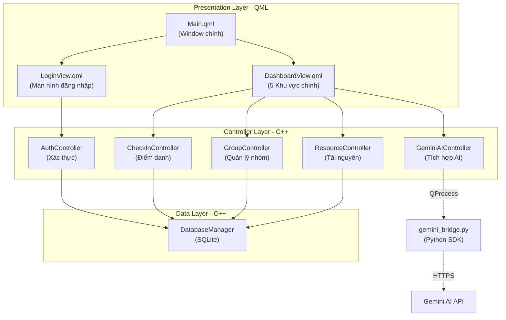
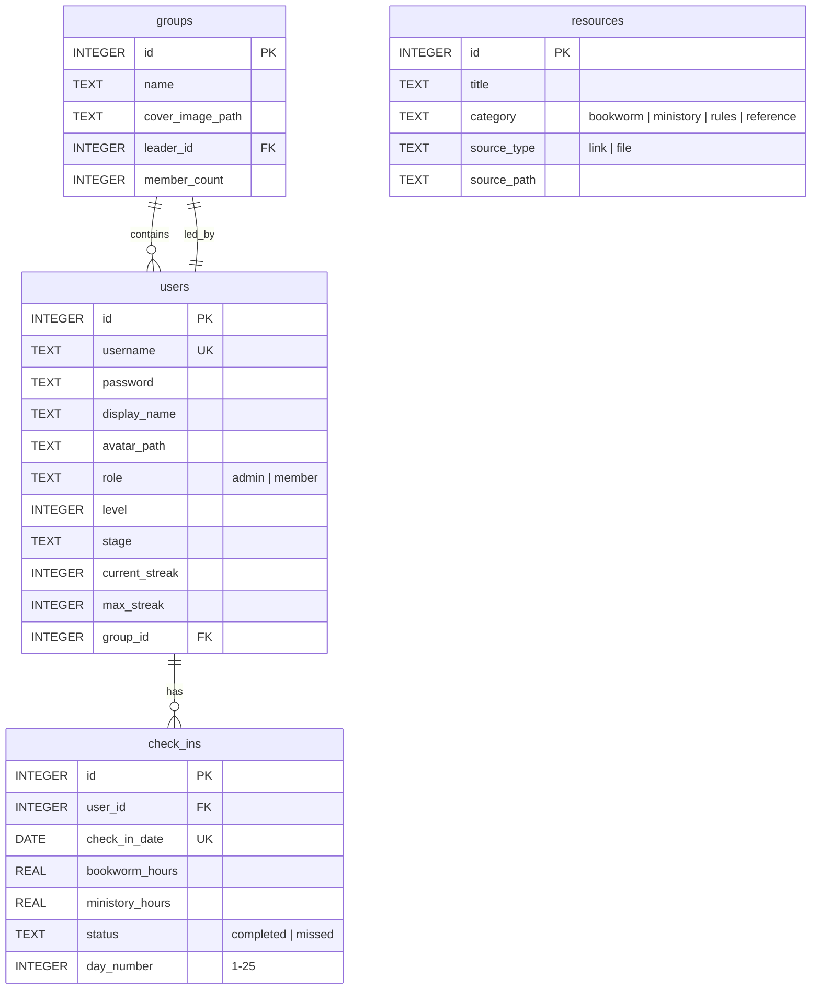
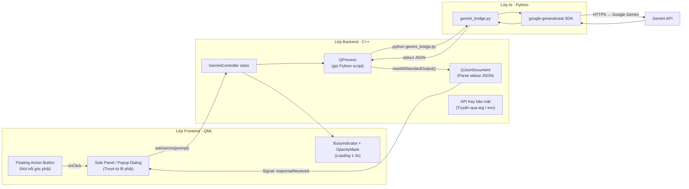
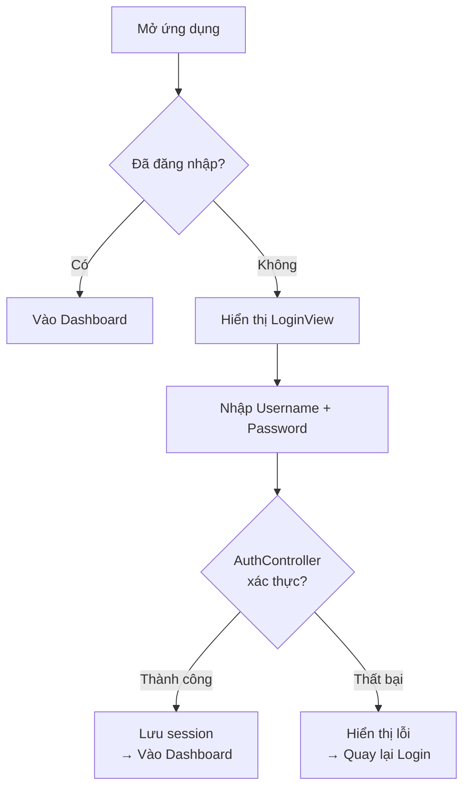

# 🔥 English Mastery Hub (Qt Edition) — Tổng Quan Dự Án Chi Tiết

## 1. Giới Thiệu Dự Án

**English Mastery Hub** là một ứng dụng desktop quản lý tiến độ học tiếng Anh trong vòng **25 ngày**, được xây dựng bằng **C++ / Qt 6 / QML** với cơ sở dữ liệu **SQLite**. Ứng dụng lấy cảm hứng thiết kế từ trang Notion "25-Day English Mastery Challenge" và mang tính **Gamification** (trò chơi hóa) cao — bao gồm hệ thống check-in hàng ngày, bảng truy nã, bục vinh danh, biểu đồ theo dõi, và kho tài nguyên tập trung.

> [!IMPORTANT]
> Dự án sử dụng **Qt 6.10+** với **QML** cho giao diện và **C++** cho logic backend. Gemini AI sẽ được tích hợp để hỗ trợ học tập thông minh.

---

## 2. Kiến Trúc Tổng Thể



### Tech Stack

| Thành phần | Công nghệ | Vai trò |
|---|---|---|
| Ngôn ngữ | C++ 17 | Logic backend, xử lý dữ liệu |
| Framework | Qt 6.10 | Nền tảng cross-platform |
| UI Engine | QML / Qt Quick | Giao diện người dùng |
| Biểu đồ | Qt Charts | Line chart, Bar chart |
| CSDL | SQLite | Lưu trữ local offline |
| AI Bridge | Python 3.x + `google-generativeai` | Gọi Gemini API qua SDK |
| AI Integration | QProcess (C++) → Python script | Cầu nối C++ ↔ Python |
| Build | CMake | Hệ thống build |

---

## 3. Trạng Thái Hiện Tại Của Dự Án (Scaffold)

Dự án đang ở giai đoạn **scaffold ban đầu** — chỉ có cấu trúc khung, chưa có logic:

| File | Trạng thái |
|---|---|
| [CMakeLists.txt](file:///F:/Project_BTL/english-mastery-hub/CMakeLists.txt) | ✅ Đã cấu hình Qt 6.10, QML module |
| [main.cpp](file:///F:/Project_BTL/english-mastery-hub/main.cpp) | ✅ Entry point cơ bản |
| [Main.qml](file:///F:/Project_BTL/english-mastery-hub/Main.qml) | ⚠️ Chỉ có Window trống 640x480 |
| [LoginView.qml](file:///F:/Project_BTL/english-mastery-hub/LoginView.qml) | ⚠️ Chỉ có Item trống |
| [authcontroller.h/cpp](file:///F:/Project_BTL/english-mastery-hub/controllers/authcontroller.h) | ⚠️ Class rỗng, chưa có method |
| [databasemanager.h/cpp](file:///F:/Project_BTL/english-mastery-hub/core/databasemanager.h) | ⚠️ Class rỗng, chưa có method |

---

## 4. Notion UI Demo — Tham Chiếu Thiết Kế

Dưới đây là giao diện Notion đang được sử dụng làm bản thiết kế mẫu:

````carousel

<!-- slide -->

<!-- slide -->

<!-- slide -->

````

---

## 5. Chi Tiết 5 Khu Vực Giao Diện Cần Xây Dựng

### 🔵 Khu Vực 1: Daily Check-in & Bảng Truy Nã

**Mục đích:** Cửa ngõ tương tác hàng ngày — check-in và theo dõi ai chưa hoàn thành.

#### Nút Check-in & Popup
- Người dùng nhấn **"Check-in"** → mở **Popup/Dialog** với overlay tối phía sau
- Popup chứa 2 trường nhập:
  - **Số giờ học Bookworm** (`SpinBox` hoặc `TextField` + `Validator`)
  - **Số giờ học Ministory** (`SpinBox` hoặc `TextField` + `Validator`)
- 2 nút hành động: **"Hủy"** và **"Gửi/Xác nhận"**
- Nút "Xác nhận" → gọi signal truyền dữ liệu xuống C++ → đóng popup

#### Bảng Truy Nã (Wanted Board)
- Dùng **`GridView`** hiển thị danh sách người chưa check-in hôm qua
- Mỗi thẻ là **`Rectangle`** bo góc với `DropShadow`:
  - **Avatar** (Image bo tròn qua `OpacityMask`)
  - **Tên** (font to, bold)
  - **Trạng thái cảnh báo** (màu cam/đỏ)
  - **Streak** (chuỗi ngày check-in liên tục)
- Thanh cuộn dọc ẩn, hiện khi danh sách vượt quá chiều cao

#### Cách triển khai trong Qt Design (QML):
```qml
// Popup check-in
Popup {
    modal: true
    dim: true  // overlay tối phía sau
    
    ColumnLayout {
        SpinBox { id: bookwormHours; from: 0; to: 24; stepSize: 1 }
        SpinBox { id: ministoryHours; from: 0; to: 24; stepSize: 1 }
        RowLayout {
            Button { text: "Hủy"; onClicked: popup.close() }
            Button { text: "Xác nhận"; onClicked: checkInController.submit(bookwormHours.value, ministoryHours.value) }
        }
    }
}

// Bảng Truy Nã
GridView {
    clip: true
    model: wantedModel  // từ C++ QAbstractListModel
    delegate: Rectangle {
        radius: 12
        layer.enabled: true
        layer.effect: DropShadow { /* ... */ }
        // Avatar + Tên + Trạng thái + Streak
    }
}
```

---

### 🟢 Khu Vực 2: Personal Area (Không Gian Cá Nhân)

**Mục đích:** Hiển thị tiến trình cá nhân dựa trên tài khoản đang đăng nhập.

#### Nửa trái: Thẻ Profile & Lưới Lịch
- **Thẻ Profile**: Avatar bo tròn (`Image` + `OpacityMask`), Tên in đậm, Streak hiện tại
- **Progress Bar**: Thanh tiến trình 25 ngày — custom `contentItem` cho màu neon trên dark theme
- **Calendar Grid**: `GridLayout` với `columns: 7` (Thứ 2→CN)
  - Offset 1 ô trống ở đầu (ngày 1 = Thứ 3)
  - Màu sắc theo trạng thái:
    - 🟩 Xanh lá = đã check-in
    - 🟥 Đỏ = bỏ lỡ
    - ⬜ Xám = chưa tới ngày

#### Nửa phải: Biểu Đồ Theo Dõi
- 2 **Line Charts** (`QtCharts::ChartView`) xếp dọc bằng `ColumnLayout`
- **Trục X**: ngày 1→25 (`ValueAxis`)
- **Trục Y**: số giờ học
- 2 `LineSeries` với màu tách biệt (Xanh dương vs Cam), bật `antialiasing: true`
- Dark theme: `backgroundColor: "transparent"`, labels màu trắng/xám nhạt

#### Cách triển khai trong Qt Design:
```qml
RowLayout {
    // Nửa trái
    Rectangle {
        Layout.fillWidth: true; Layout.preferredWidth: 1
        ColumnLayout {
            Image { /* Avatar + OpacityMask bo tròn */ }
            Text { text: currentUser.name; font.bold: true }
            ProgressBar { value: completedDays / 25.0 }
            GridLayout {
                columns: 7
                Repeater {
                    model: 25 + 1  // 1 offset + 25 ngày
                    Rectangle {
                        color: index === 0 ? "transparent"
                             : dayStatus[index-1] === "done" ? "#4CAF50"
                             : dayStatus[index-1] === "missed" ? "#F44336"
                             : "#616161"
                    }
                }
            }
        }
    }
    // Nửa phải
    ColumnLayout {
        Layout.fillWidth: true; Layout.preferredWidth: 1
        ChartView {
            title: "Giờ Học Bookworm"
            backgroundColor: "transparent"
            LineSeries { /* data từ C++ model */ }
        }
        ChartView {
            title: "Giờ Học Ministory"
            backgroundColor: "transparent"
            LineSeries { /* data từ C++ model */ }
        }
    }
}
```

---

### 🟡 Khu Vực 3: Quản Lý Nhóm & Biểu Đồ So Sánh

**Mục đích:** Dashboard toàn cảnh hiệu suất các nhóm — tạo không khí thi đua.

#### Danh Sách Nhóm (Horizontal ListView)
- `ListView` với `orientation: ListView.Horizontal`, `spacing`, `clip: true`
- Mỗi thẻ nhóm (`Delegate`):
  - **Nửa trên**: Ảnh bìa (`Image` + `fillMode: PreserveAspectCrop` + `OpacityMask` bo góc)
  - **Nửa dưới**: Tên nhóm (bold), Nhóm trưởng, Số thành viên
  - `DropShadow` nhẹ
- Ví dụ nhóm: *Gà Trống KFC, Siêu Trùm Tắm Mưa, Ếch Ộp*

#### Biểu Đồ So Sánh
- **Bar Chart** (Bookworm): `BarSeries` + `BarCategoryAxis` (tên nhóm) + gradient/neon
- **Line Chart** (Ministory): `LineSeries` + `CategoryAxis` + `antialiasing`, `width: 3`
- Có thể thêm `ScatterSeries` ẩn để hiện tooltip khi hover

---

### 🟠 Khu Vực 4: Bục Vinh Danh (Top Performer & Gamification)

**Mục đích:** Xếp hạng tự động Top 3 cá nhân — kích thích động lực học.

#### Layout Tỷ Lệ 6:4
```qml
RowLayout {
    Rectangle {
        Layout.fillWidth: true
        Layout.preferredWidth: 6  // 60% - Top 3 Bookworm
        ListView {
            header: Text { text: "👑 TOP 3 BOOKWORM"; font.bold: true; font.pixelSize: 24 }
            model: top3BookwormModel
            delegate: /* Thẻ vinh danh */
        }
    }
    Rectangle {
        Layout.fillWidth: true
        Layout.preferredWidth: 4  // 40% - Top 3 Ministory
        ListView {
            header: Text { text: "🔥 TOP 3 MINISTORY"; font.bold: true; font.pixelSize: 24 }
            model: top3MinistoryModel
            delegate: /* Thẻ vinh danh */
        }
    }
}
```

#### Thẻ Delegate Vinh Danh
- **Ranking icon**: Huy chương Vàng/Bạc/Đồng hoặc Rectangle tròn đánh số 1/2/3
- **Avatar** bo tròn + **Tên** + **Số giờ học** + **Stage/Level**
- **Top 1** đặc biệt: kích thước lớn hơn, viền phát sáng (`Glow`/`DropShadow`)

---

### 🟣 Khu Vực 5: Kho Tài Nguyên Chung

**Mục đích:** Thư viện lưu trữ tập trung — tài liệu, giáo trình, quy định.

#### Bố Cục
- Toàn bộ bọc trong **`ScrollView`** hoặc **`Flickable`**
- Phân loại theo nhóm trong `ColumnLayout`:
  - 📚 Thư viện Bookworms & Audiobooks
  - 📋 Quy định & Kỷ luật 25 ngày
  - 🎧 Tài liệu Ministory

#### Thẻ Tài Liệu (Resource Delegate)
- `Rectangle` bo góc với hover effect (`MouseArea` + `hoverEnabled`)
- Bố cục `RowLayout`:
  - **Trái**: Icon phân loại (🌐 Web link, 📎 File)
  - **Giữa**: Tên tài liệu
  - **Phải**: Nút "Mở" / "Tải về"
- Click → mở trình duyệt web (link) hoặc phần mềm đọc PDF (file)

---

## 6. Cơ Sở Dữ Liệu — SQLite Schema



### Lý Do Chọn SQLite
- **Serverless**: Không cần cài đặt server — toàn bộ dữ liệu trong 1 file `database.db`
- **Tích hợp Qt native**: `QSqlDatabase` + driver SQLite có sẵn
- **Siêu nhẹ**: Truy xuất gần như tức thì cho lượng dữ liệu nhỏ
- **Backup đơn giản**: Copy/paste file là xong

---

## 7. Cách Sử Dụng Qt Design (Qt Creator + QML)

### 7.1 Kiến Trúc QML — Cây File Dự Kiến

```
english-mastery-hub/
├── CMakeLists.txt
├── main.cpp
├── Main.qml                    ← Window chính + StackView/SwipeView
├── LoginView.qml               ← Màn hình đăng nhập
├── DashboardView.qml           ← Layout 5 khu vực
├── components/
│   ├── CheckInPopup.qml        ← Popup check-in
│   ├── WantedBoard.qml         ← GridView bảng truy nã
│   ├── ProfileCard.qml         ← Thẻ cá nhân + lưới lịch
│   ├── PersonalCharts.qml      ← 2 Line charts cá nhân
│   ├── GroupCarousel.qml       ← Horizontal ListView nhóm
│   ├── GroupCharts.qml         ← Bar + Line charts nhóm
│   ├── TopPerformerBoard.qml   ← Bục vinh danh 6:4
│   ├── ResourceLibrary.qml     ← Kho tài nguyên
│   └── ResourceCard.qml       ← Thẻ tài liệu đơn lẻ
├── controllers/
│   ├── authcontroller.h/cpp
│   ├── checkincontroller.h/cpp
│   ├── groupcontroller.h/cpp
│   └── resourcecontroller.h/cpp
├── core/
│   ├── databasemanager.h/cpp
│   └── geminicontroller.h/cpp  ← QProcess bridge → Python
├── models/
│   ├── usermodel.h/cpp
│   ├── checkinmodel.h/cpp
│   ├── groupmodel.h/cpp
│   └── resourcemodel.h/cpp
├── scripts/
│   └── gemini_bridge.py        ← Python SDK gọi Gemini API
└── assets/
    ├── images/
    ├── icons/
    └── fonts/
```

### 7.2 Cách Dùng Qt Design Studio / Qt Creator

#### Bước 1: Thiết kế giao diện bằng Qt Design Studio
- Mở **Qt Design Studio** (hoặc chế độ Design trong Qt Creator)
- Kéo thả các component QML: `Rectangle`, `Text`, `Image`, `Button`, `ListView`, `GridView`
- Thiết lập **Layout**: `RowLayout`, `ColumnLayout`, `GridLayout` cho responsive
- Sử dụng **States** để tạo animation chuyển trạng thái (hover, active, etc.)

#### Bước 2: Kết nối QML ↔ C++ Backend

```cpp
// main.cpp - Đăng ký controllers
#include <QGuiApplication>
#include <QQmlApplicationEngine>
#include <QQmlContext>
#include "controllers/authcontroller.h"
#include "controllers/checkincontroller.h"
#include "core/databasemanager.h"

int main(int argc, char *argv[]) {
    QGuiApplication app(argc, argv);
    QQmlApplicationEngine engine;

    // Khởi tạo database
    DatabaseManager dbManager;
    dbManager.initialize();

    // Đăng ký controller vào QML context
    AuthController authCtrl(&dbManager);
    engine.rootContext()->setContextProperty("authController", &authCtrl);

    CheckInController checkInCtrl(&dbManager);
    engine.rootContext()->setContextProperty("checkInController", &checkInCtrl);

    engine.loadFromModule("EnglishMasteryHub", "Main");
    return QCoreApplication::exec();
}
```

#### Bước 3: Expose C++ Model cho QML

```cpp
// models/checkinmodel.h
class CheckInModel : public QAbstractListModel {
    Q_OBJECT
public:
    enum Roles { DateRole = Qt::UserRole + 1, BookwormRole, MinistoryRole, StatusRole };

    int rowCount(const QModelIndex &parent) const override;
    QVariant data(const QModelIndex &index, int role) const override;
    QHash<int, QByteArray> roleNames() const override;

    Q_INVOKABLE void refresh(int userId);
};
```

```qml
// Sử dụng trong QML
ListView {
    model: checkInModel
    delegate: Rectangle {
        Text { text: model.date }
        Text { text: model.bookwormHours + " giờ Bookworm" }
    }
}
```

#### Bước 4: Signal/Slot giữa QML và C++

```cpp
// Controller gọi từ QML
class CheckInController : public QObject {
    Q_OBJECT
public:
    Q_INVOKABLE bool submitCheckIn(int bookwormHours, int ministoryHours);

signals:
    void checkInSuccess();
    void checkInFailed(const QString &error);
};
```

```qml
// QML lắng nghe signal
Connections {
    target: checkInController
    function onCheckInSuccess() { popup.close(); toast.show("Check-in thành công!") }
    function onCheckInFailed(error) { errorLabel.text = error }
}
```

---

## 8. 🤖 Tích Hợp Gemini AI Vào Hệ Thống (Cập Nhật Từ Docs)

> [!IMPORTANT]
> AI không phải chỉ là chatbox. Nó sẽ **"đọc" dữ liệu SQLite** để tương tác **theo ngữ cảnh** của từng khu vực.

### 8.1 Vai Trò Cụ Thể Của AI Trong 3 Khu Vực

| Khu vực | Vai trò AI | Mô tả |
|---|---|---|
| **KV1** — Bảng Truy Nã | 🕵️ **Giám thị ảo** | AI tự động sinh lời nhắc nhở cá nhân hóa (hài hước/nghiêm khắc) dựa trên số ngày lười biếng. VD: *"Phúc Tiền à, chuỗi 5 ngày sắp tan thành mây khói rồi!"* |
| **KV2** — Không gian cá nhân | 📊 **Chuyên gia phân tích** | Người dùng bấm **"Nhận xét tiến độ"** → C++ gom số liệu giờ Bookworm/Ministory → gửi Gemini → AI phân tích điểm mạnh/yếu và đề xuất lộ trình ngày mai |
| **KV5** — Kho tài nguyên | 📚 **Gia sư Tiếng Anh** | Nút **"Hỏi AI về tài liệu này"** → AI tóm tắt bài đọc Bookworm, trích xuất từ vựng khó, giải thích ngữ pháp ngay trong app |

### 8.2 Kiến Trúc 3 Lớp + Python Bridge (Đề Xuất Mới)



**Lớp AI (Python):**
- `gemini_bridge.py` sử dụng `google-generativeai` SDK — gọi API chỉ cần 3-5 dòng
- Nhận tham số qua **command-line arguments**, trả kết quả qua **stdout** (JSON)
- 4 chế độ: `warn` | `analyze` | `summarize` | `chat`

**Lớp Backend (C++):**
- `QProcess` khởi chạy Python script — **async** (signal `finished`)
- `QJsonDocument` parse kết quả từ stdout
- **API Key truyền qua argument** hoặc biến môi trường — không lộ trên QML

**Lớp Frontend (QML):**
- **Floating Action Button** (logo AI) ở góc phải màn hình
- Click → **Side Panel** trượt từ lề phải hoặc **Popup Dialog**
- **BusyIndicator** + `OpacityMask` hiển thị khi chờ (1-3s)

### 8.3 Lộ Trình 3 Bước Triển Khai (Cập Nhật)

| Bước | Tên | Chi tiết |
|:---:|---|---|
| 1️⃣ | **Viết Python bridge** | Tạo `scripts/gemini_bridge.py` với 4 mode, test riêng bằng `python gemini_bridge.py --mode chat --data "Hello"` |
| 2️⃣ | **Xây cầu nối C++** | Tạo class `GeminiController` → hàm `askGemini(prompt)` dùng `QProcess` → signal `responseReceived(text)` |
| 3️⃣ | **Vẽ giao diện Side Panel** | Gắn `onClicked` truyền dữ liệu học tập xuống C++ → `Text` component hiển thị câu trả lời |

### 8.4 Code Triển Khai — Python Bridge + C++ Controller

#### `scripts/gemini_bridge.py` (Python)

```python
# scripts/gemini_bridge.py
import sys, json, argparse
import google.generativeai as genai

def main():
    parser = argparse.ArgumentParser()
    parser.add_argument("--mode", choices=["warn", "analyze", "summarize", "chat"], required=True)
    parser.add_argument("--data", required=True)
    parser.add_argument("--api-key", required=True)
    args = parser.parse_args()

    genai.configure(api_key=args.api_key)
    model = genai.GenerativeModel("gemini-pro")

    prompts = {
        "warn": f"Hãy viết 1 lời nhắc nhở hài hước bằng tiếng Việt, giọng điệu thân thiện nhưng nghiêm khắc, tối đa 2 câu. Thông tin: {args.data}",
        "analyze": f"Phân tích tiến độ học tập và đề xuất lộ trình ngày mai: {args.data}",
        "summarize": f"Tóm tắt tài liệu tiếng Anh, trích xuất từ vựng khó, giải thích ngữ pháp: {args.data}",
        "chat": args.data,
    }

    try:
        response = model.generate_content(prompts[args.mode])
        print(json.dumps({"ok": True, "text": response.text}, ensure_ascii=False))
    except Exception as e:
        print(json.dumps({"ok": False, "error": str(e)}, ensure_ascii=False))
        sys.exit(1)

if __name__ == "__main__":
    main()
```

#### `core/geminicontroller.h` (C++)

```cpp
// core/geminicontroller.h
class GeminiController : public QObject {
    Q_OBJECT
    Q_PROPERTY(bool isLoading READ isLoading NOTIFY loadingChanged)
    Q_PROPERTY(QString lastResponse READ lastResponse NOTIFY responseReceived)
public:
    explicit GeminiController(QObject *parent = nullptr);

    // Gọi từ QML qua Q_INVOKABLE
    Q_INVOKABLE void askGemini(const QString &prompt);
    Q_INVOKABLE void analyzeProgress(const QString &dataJson);  // KV2
    Q_INVOKABLE void summarizeResource(const QString &content); // KV5
    Q_INVOKABLE void generateWarning(const QString &name, int lazyDays); // KV1

    bool isLoading() const { return m_isLoading; }
    QString lastResponse() const { return m_lastResponse; }

signals:
    void responseReceived(const QString &text);  // ← Signal trả về QML
    void errorOccurred(const QString &error);
    void loadingChanged();

private:
    void runPythonBridge(const QString &mode, const QString &data);
    QString m_apiKey;       // Đọc từ env GEMINI_API_KEY
    QString m_lastResponse;
    bool m_isLoading = false;
};
```

#### `core/geminicontroller.cpp` (C++ — logic chính)

```cpp
// core/geminicontroller.cpp
#include "geminicontroller.h"
#include <QProcess>
#include <QJsonDocument>
#include <QJsonObject>
#include <QCoreApplication>

GeminiController::GeminiController(QObject *parent) : QObject(parent) {
    m_apiKey = qEnvironmentVariable("GEMINI_API_KEY");
}

void GeminiController::runPythonBridge(const QString &mode, const QString &data) {
    m_isLoading = true; emit loadingChanged();

    auto *proc = new QProcess(this);
    QString scriptPath = QCoreApplication::applicationDirPath() + "/scripts/gemini_bridge.py";

    connect(proc, &QProcess::finished, this, [this, proc](int exitCode) {
        m_isLoading = false; emit loadingChanged();
        auto output = proc->readAllStandardOutput();
        auto doc = QJsonDocument::fromJson(output).object();

        if (exitCode == 0 && doc["ok"].toBool()) {
            m_lastResponse = doc["text"].toString();
            emit responseReceived(m_lastResponse);
        } else {
            emit errorOccurred(doc["error"].toString());
        }
        proc->deleteLater();
    });

    proc->start("python", {scriptPath, "--mode", mode, "--data", data, "--api-key", m_apiKey});
}

// KV1: Giám thị ảo — sinh lời nhắc cá nhân hóa
void GeminiController::generateWarning(const QString &name, int lazyDays) {
    runPythonBridge("warn", QString("%1 đã lười biếng %2 ngày không check-in").arg(name).arg(lazyDays));
}

// KV2: Phân tích dữ liệu học tập
void GeminiController::analyzeProgress(const QString &dataJson) {
    runPythonBridge("analyze", dataJson);
}

// KV5: Tóm tắt tài liệu
void GeminiController::summarizeResource(const QString &content) {
    runPythonBridge("summarize", content);
}

// Chat tự do
void GeminiController::askGemini(const QString &prompt) {
    runPythonBridge("chat", prompt);
}
```

### 8.5 Side Panel AI — QML

```qml
// Floating Action Button (góc phải dưới)
Rectangle {
    id: aiFab; width: 56; height: 56; radius: 28
    anchors { right: parent.right; bottom: parent.bottom; margins: 20 }
    color: "#4285F4"
    Text { text: "🤖"; anchors.centerIn: parent; font.pixelSize: 24 }
    MouseArea { anchors.fill: parent; onClicked: aiSidePanel.open() }
}

// Side Panel trượt từ phải
Drawer {
    id: aiSidePanel; edge: Qt.RightEdge; width: 360
    ColumnLayout {
        anchors.fill: parent; anchors.margins: 16
        Text { text: "🤖 AI Assistant"; font.bold: true; font.pixelSize: 20 }

        ScrollView {
            Layout.fillWidth: true; Layout.fillHeight: true
            TextArea { text: geminiController.lastResponse; readOnly: true; wrapMode: TextArea.WordWrap }
        }

        // BusyIndicator khi đang chờ
        BusyIndicator { running: geminiController.isLoading; Layout.alignment: Qt.AlignHCenter }

        TextField { id: prompt; Layout.fillWidth: true; placeholderText: "Hỏi AI..." }
        RowLayout {
            Button { text: "Gửi"; onClicked: geminiController.askGemini(prompt.text) }
            Button { text: "📊 Tiến độ"; onClicked: geminiController.analyzeProgress(currentUserDataJson) }
        }
    }
}
```

---

## 9. Hệ Thống Bảo Mật & Phân Quyền

### Luồng Xác Thực



### Phân Quyền

| Quyền | Admin (Nhóm trưởng) | Member (Thành viên) |
|---|:---:|:---:|
| Đăng nhập | ✅ | ✅ |
| Check-in hàng ngày | ✅ | ✅ |
| Xem tiến độ cá nhân | ✅ | ✅ |
| Xem bảng xếp hạng | ✅ | ✅ |
| **Tạo tài khoản mới** | ✅ | ❌ |
| **Quản lý nhóm** | ✅ | ❌ |
| **Thêm/Sửa tài nguyên** | ✅ | ❌ |

> [!NOTE]
> Thành viên **KHÔNG THỂ** tự đăng ký. Chỉ Admin mới có quyền cấp tài khoản và gửi username/password trực tiếp.

---

## 10. Các Nhóm Thông Tin Dữ Liệu Cần Quản Lý

### Nhóm 1: Tài Khoản & Cá Nhân
- Username, Password (do Admin cấp)
- Display Name, Avatar (upload từ máy)
- Role: `admin` | `member`
- Level, Stage (xếp hạng)
- Current Streak, Max Streak

### Nhóm 2: Đội Nhóm
- Tên nhóm (VD: Gà Trống KFC, Ếch Ộp)
- Nhóm trưởng
- Ảnh bìa nhóm, Số lượng thành viên

### Nhóm 3: Lịch Sử Điểm Danh
- User ID (ai check-in)
- Ngày điểm danh (day_number 1-25)
- Giờ Bookworm, Giờ Ministory
- Trạng thái: `completed` | `missed`

### Nhóm 4: Kho Tài Nguyên
- Tên tài liệu
- Phân loại (giáo trình, quy định, tham khảo)
- Loại nguồn: `link` (web) | `file` (local)
- Đường dẫn/URL

---

## 11. Danh Sách Công Việc Cần Thực Hiện

### Phase 1: Nền Tảng (Foundation)
- [ ] Triển khai [DatabaseManager](file:///F:/Project_BTL/english-mastery-hub/core/databasemanager.h#6-14) — tạo bảng SQLite, CRUD operations
- [ ] Triển khai [AuthController](file:///F:/Project_BTL/english-mastery-hub/controllers/authcontroller.cpp#3-6) — đăng nhập, phân quyền, session
- [ ] Xây dựng [LoginView.qml](file:///F:/Project_BTL/english-mastery-hub/LoginView.qml) — form đăng nhập đẹp + dark theme
- [ ] Cấu hình [Main.qml](file:///F:/Project_BTL/english-mastery-hub/Main.qml) — StackView/SwipeView cho navigation

### Phase 2: Giao Diện Chính (Dashboard)
- [ ] Khu vực 1: Check-in Popup + Wanted Board (GridView)
- [ ] Khu vực 2: Profile Card + Calendar Grid + Line Charts
- [ ] Khu vực 3: Group Carousel + Bar/Line Charts
- [ ] Khu vực 4: Top Performer Board (layout 6:4)
- [ ] Khu vực 5: Resource Library (ScrollView + hover cards)

### Phase 3: Backend Logic
- [ ] `CheckInController` — submit check-in, tính streak, cập nhật trạng thái
- [ ] `GroupController` — load nhóm, tính tổng giờ nhóm, so sánh
- [ ] `ResourceController` — mở link/file, quản lý tài liệu
- [ ] C++ Models (`QAbstractListModel`) cho tất cả các view

### Phase 4: Tích Hợp AI (Python Bridge)
- [ ] `scripts/gemini_bridge.py` — Python script dùng `google-generativeai` SDK (4 mode: warn/analyze/summarize/chat)
- [ ] `GeminiController` (C++) — QProcess bridge gọi Python script
- [ ] AI Side Panel (Drawer) trong UI — FAB button + chat interface
- [ ] Tích hợp AI vào KV1 (auto warning), KV2 (phân tích tiến độ), KV5 (tóm tắt tài liệu)

### Phase 5: Polish & Testing
- [ ] Dark theme toàn ứng dụng
- [ ] Animation/micro-interactions (hover, transitions)
- [ ] Responsive layout cho nhiều kích thước màn hình
- [ ] Testing toàn bộ luồng xác thực, check-in, xếp hạng
- [ ] Seed data mẫu để demo

---

## 12. CMakeLists.txt — Cập Nhật Dự Kiến

```cmake
cmake_minimum_required(VERSION 3.16)
project(EnglishMasteryHub VERSION 0.1 LANGUAGES CXX)

set(CMAKE_CXX_STANDARD_REQUIRED ON)

find_package(Qt6 REQUIRED COMPONENTS Quick Sql Charts Network)

qt_standard_project_setup(REQUIRES 6.10)

qt_add_executable(appEnglishMasteryHub main.cpp)

qt_add_qml_module(appEnglishMasteryHub
    URI EnglishMasteryHub
    QML_FILES
        Main.qml
        LoginView.qml
        DashboardView.qml
        components/CheckInPopup.qml
        components/WantedBoard.qml
        components/ProfileCard.qml
        components/PersonalCharts.qml
        components/GroupCarousel.qml
        components/GroupCharts.qml
        components/TopPerformerBoard.qml
        components/ResourceLibrary.qml
        components/ResourceCard.qml
    SOURCES
        core/databasemanager.h core/databasemanager.cpp
        core/geminicontroller.h core/geminicontroller.cpp
        controllers/authcontroller.h controllers/authcontroller.cpp
        controllers/checkincontroller.h controllers/checkincontroller.cpp
        controllers/groupcontroller.h controllers/groupcontroller.cpp
        controllers/resourcecontroller.h controllers/resourcecontroller.cpp
        models/usermodel.h models/usermodel.cpp
        models/checkinmodel.h models/checkinmodel.cpp
        models/groupmodel.h models/groupmodel.cpp
        models/resourcemodel.h models/resourcemodel.cpp
)

target_link_libraries(appEnglishMasteryHub
    PRIVATE Qt6::Quick Qt6::Sql Qt6::Charts Qt6::Network
)
```

> [!TIP]
> - `Qt6::Sql` → cho SQLite database
> - `Qt6::Charts` → cho biểu đồ Line/Bar
> - `Qt6::Network` → cho HTTP requests đến Gemini API

---

> [!CAUTION]
> **Lưu ý bảo mật Gemini API Key:** Không nên hardcode API key trong source code. Sử dụng biến môi trường (`GEMINI_API_KEY`) hoặc file config riêng không commit vào git.
