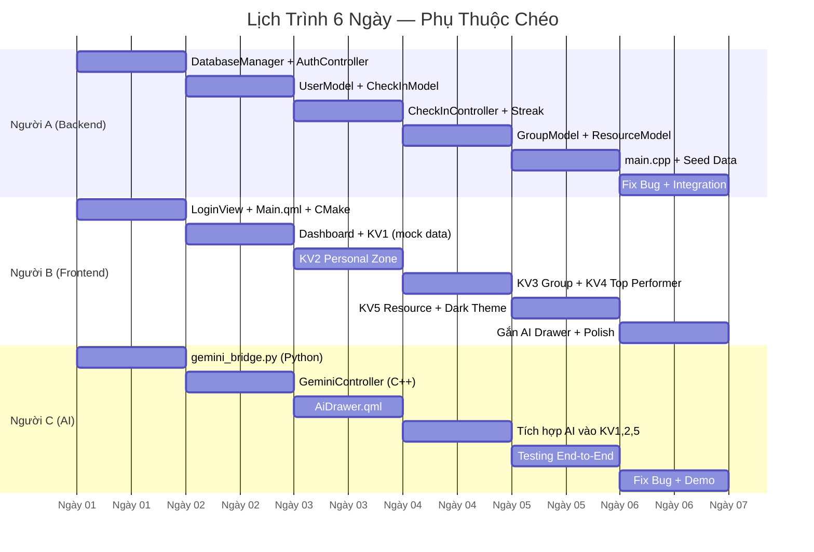
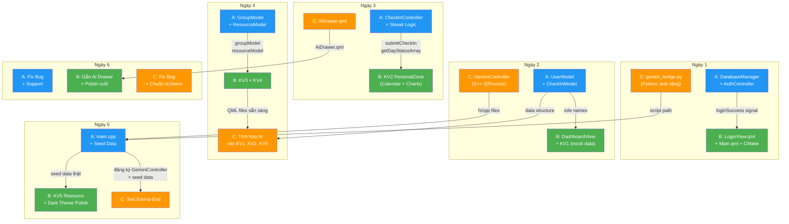
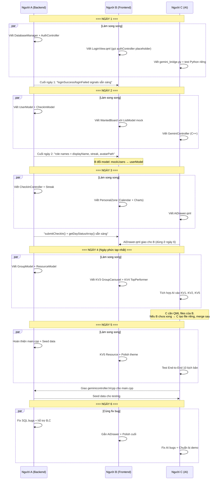
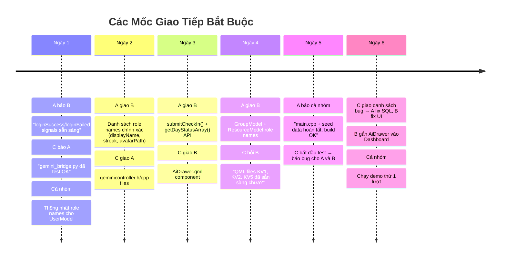

# 🔗 Phân Tích Kết Nối Công Việc Giữa 3 Người A, B, C

## 1. Tổng Quan Vai Trò & Ranh Giới Trách Nhiệm

| Người | Vai trò | Sản phẩm chính | Phụ thuộc vào |
|:---:|---|---|---|
| **A** | Backend C++ Engineer | DatabaseManager, Controllers, Models, `main.cpp` | Không ai (A là nền móng) |
| **B** | Frontend QML Designer | Toàn bộ giao diện QML (Login → 5 KV Dashboard) | **A** (data + signals), **C** (AI Drawer) |
| **C** | AI + Integration Specialist | Python bridge, GeminiController, Testing | **A** (models, seed data), **B** (QML files để tích hợp AI) |

> [!IMPORTANT]
> **A là người xây nền móng** — B và C đều phụ thuộc vào sản phẩm của A. Tuy nhiên, B và C có thể làm việc **song song** với A nhờ kỹ thuật mock data và tách module.

---

## 2. Bản Đồ Phụ Thuộc Chéo Theo Ngày



---

## 3. Ma Trận Kết Nối Chi Tiết — Ai Giao Gì Cho Ai, Khi Nào?

### 3.1 Người A → Người B (Luồng chính: Data → UI)

Đây là **luồng phụ thuộc nặng nhất** trong dự án. B cần sản phẩm từ A để bind data vào giao diện.

| Ngày A giao | Sản phẩm A giao | B nhận để làm gì | Giao diện cụ thể |
|:---:|---|---|---|
| **Ngày 1** | `authController.login()` + signals `loginSuccess`, `loginFailed` | B kết nối vào `LoginView.qml` — xử lý đăng nhập | [LoginView.qml](file:///f:/Project_BTL/english-mastery-hub/LoginView.qml) |
| **Ngày 2** | `userModel` (role names: `displayName`, `avatarPath`, `streak`) + `checkInModel` | B bind vào `GridView`/`ListView` trong WantedBoard, PersonalZone | `WantedBoard.qml`, `PersonalZone.qml` |
| **Ngày 3** | `checkInController.submitCheckIn()` + `getDayStatusArray()` | B kết nối vào CheckInPopup (nút Xác nhận) + Calendar Grid | `CheckInPopup.qml`, Calendar trong `PersonalZone.qml` |
| **Ngày 4** | `groupModel`, `resourceModel` (role names) + `groupController.getGroupNames()` | B hoàn thiện KV3, KV4, KV5 | `GroupCarousel.qml`, `TopPerformerBoard.qml`, `ResourceLibrary.qml` |
| **Ngày 5** | `main.cpp` hoàn chỉnh + Seed data | B có data thật để test toàn bộ UI | Tất cả QML files |

### 3.2 Người A → Người C (Luồng phụ: Infrastructure)

| Ngày | A giao/hỗ trợ | C cần để làm gì |
|:---:|---|---|
| **Ngày 2** | Models (UserModel, CheckInModel) đã có role names | C biết cấu trúc data JSON để thiết kế prompt AI phù hợp |
| **Ngày 5** | `main.cpp` — đăng ký `GeminiController` vào QML context | C giao `geminicontroller.h/cpp` cho A, A thêm vào `main.cpp` |
| **Ngày 5** | Seed data mẫu (10-12 users, 5-7 ngày check-in) | C dùng để test end-to-end toàn bộ luồng |

### 3.3 Người C → Người B (Luồng phụ: AI Component → Dashboard)

| Ngày C giao | Sản phẩm | B làm gì |
|:---:|---|---|
| **Ngày 3** | `AiDrawer.qml` (FAB button + Side Drawer) | B gắn vào `DashboardView.qml` ở ngày 6: chỉ cần 1 dòng `AiDrawer { anchors.fill: parent }` |

### 3.4 Người C → Người A (Luồng ngược: AI files → Build system)

| Ngày C giao | Sản phẩm | A làm gì |
|:---:|---|---|
| **Ngày 2** | `geminicontroller.h/cpp` | A thêm vào `CMakeLists.txt` SOURCES + đăng ký vào `main.cpp` ngày 5 |
| **Ngày 1** | `scripts/gemini_bridge.py` | A biết script path để cấu hình deploy cùng executable |

---

## 4. Sơ Đồ Tổng Thể Dòng Chảy Phụ Thuộc



---

## 5. Cách Xử Lý Phần Việc Chung — Chiến Lược Song Song

### 5.1 Vấn đề: B phụ thuộc A nhưng cả hai bắt đầu cùng ngày

**Giải pháp: Kỹ thuật Mock Data + Hợp đồng Interface**



### 5.2 Ba Kỹ Thuật Chính Để Làm Việc Song Song

#### Kỹ thuật 1: Mock Data (B dùng khi chờ A)

B **không cần chờ** A hoàn thành model. B tạo `ListModel` giả trực tiếp trong QML:

```qml
// B viết trước với mock data
ListModel {
    id: mockUsers
    ListElement { displayName: "Nguyễn Văn A"; streak: 5; avatarPath: "" }
    ListElement { displayName: "Trần Thị B"; streak: 3; avatarPath: "" }
}

GridView {
    model: mockUsers  // ← Tạm dùng mock
    // Khi A xong → đổi thành: model: userModel
}
```

> [!TIP]
> **Quy tắc đặt tên:** A và B **thống nhất trước** tên role (VD: `displayName`, `streak`, `avatarPath`) để B viết delegate đúng ngay từ đầu. Khi A giao model thật, B chỉ cần đổi 1 dòng `model:`.

#### Kỹ thuật 2: Hợp Đồng Interface (A định nghĩa API trước)

A công bố **signature** của controller ngay ngày 1, dù chưa implement:

```cpp
// A gửi "hợp đồng" cho B ngày 1:
// "CheckInController sẽ có:"
Q_INVOKABLE bool submitCheckIn(double bookwormHours, double ministoryHours);
// → return true/false
// → signals: checkInSuccess(), checkInFailed(reason)

Q_INVOKABLE QVariantList getDayStatusArray(int userId);
// → return ["done", "missed", "future", "future", ...]
```

B dựa vào hợp đồng này để viết UI, không cần chờ implementation.

#### Kỹ thuật 3: Tách Module (C tạo file riêng khi B chưa sẵn sàng)

Ngày 4, C cần sửa QML files của B (thêm nút AI vào KV1, KV2, KV5). Nếu B chưa xong:

```
Cách 1 (ưu tiên): C viết code AI riêng trong file tách biệt
    → Tạo file ai_kv1_additions.qml, ai_kv2_additions.qml
    → Ngày 6 merge vào files chính của B

Cách 2: C và B pair-programming
    → C nói cho B cần thêm gì, B gắn vào
```

---

## 6. Điểm Xung Đột Tiềm Ẩn & Cách Giải Quyết

### 6.1 Xung đột CMakeLists.txt

**Vấn đề:** Cả 3 người đều cần sửa `CMakeLists.txt` để thêm files mới.

| Người | Thêm vào CMakeLists.txt |
|---|---|
| A | `databasemanager.h/cpp`, `authcontroller.h/cpp`, `usermodel.h/cpp`, ... |
| B | `LoginView.qml`, `DashboardView.qml`, `components/*.qml` |
| C | `geminicontroller.h/cpp` |

**Giải pháp:**
- **B quản lý CMakeLists.txt** (ngày 1, nhiệm vụ 1.1)
- A và C **báo B** khi có file mới cần thêm
- Hoặc: sử dụng glob pattern `file(GLOB_RECURSE ...)` để auto-detect files

### 6.2 Xung đột main.cpp

**Vấn đề:** `main.cpp` là file duy nhất mà sản phẩm của cả 3 người hội tụ.

```cpp
// main.cpp — Điểm hội tụ
DatabaseManager dbManager;          // ← A tạo
AuthController authCtrl(&dbManager); // ← A tạo
UserModel userModel(&dbManager);     // ← A tạo
GeminiController geminiCtrl;         // ← C tạo, A đăng ký

ctx->setContextProperty("authController", &authCtrl);  // ← B dùng trong QML
ctx->setContextProperty("geminiController", &geminiCtrl); // ← C dùng trong QML
```

**Giải pháp:**
- **A sở hữu `main.cpp`** — chỉ A sửa file này
- B và C **giao header files** cho A, kèm hướng dẫn:
  - C: "Thêm `#include "core/geminicontroller.h"`, tạo instance, đăng ký `geminiController`"
  - B: "Đăng ký context property tên `authController`, `userModel`, ..."

### 6.3 Xung đột Ngày 4: C cần QML files của B

**Vấn đề:** C cần sửa `WantedBoard.qml`, `PersonalZone.qml`, `ResourceCard.qml` để thêm nút AI — nhưng B có thể chưa hoàn thành.

**Giải pháp theo mức độ:**

| Tình huống | Cách xử lý |
|---|---|
| B **đã xong** KV1, KV2, KV5 | C trực tiếp thêm nút AI vào files của B |
| B **đang làm** nhưng file đã tồn tại | C tạo branch riêng, merge sau |
| B **chưa bắt đầu** | C viết đoạn code AI riêng (snippets), ngày 6 B gắn vào |

---

## 7. Bảng Tổng Hợp: Việc Riêng vs Việc Chung

### Việc hoàn toàn ĐỘC LẬP (không cần ai khác)

| Người | Công việc độc lập | Ngày |
|---|---|---|
| **A** | Viết `DatabaseManager`, tạo schema, seed data, viết SQL queries | Ngày 1-2 |
| **A** | Logic tính streak, `getDayStatusArray()` | Ngày 3 |
| **B** | Thiết kế layout, color palette, hover effects, animations | Ngày 1-5 |
| **B** | Dark theme polish, responsive testing | Ngày 5-6 |
| **C** | Viết + test `gemini_bridge.py` (chạy hoàn toàn riêng bằng Python) | Ngày 1 |
| **C** | Viết `GeminiController` C++ class | Ngày 2 |
| **C** | Thiết kế `AiDrawer.qml` (FAB + Side Panel) | Ngày 3 |

### Việc CẦN PHỐI HỢP (phụ thuộc người khác)

| Việc chung | Ai liên quan | Cách phối hợp |
|---|---|---|
| **Bind model vào QML** | A giao role names → B bind | A gửi danh sách role names chính xác, B đổi `model:` từ mock → thật |
| **Signal/Slot Login** | A phát signal → B lắng nghe | A: `emit loginSuccess()` / B: `Connections { target: authController }` |
| **Đăng ký vào main.cpp** | C giao h/cpp → A đăng ký | C giao file + hướng dẫn 2 dòng code cần thêm |
| **Gắn AI Drawer** | C giao QML → B gắn | B thêm 1 dòng: `AiDrawer { anchors.fill: parent }` |
| **Tích hợp AI vào KV** | C cần QML của B | C thêm Button + Text vào files của B (hoặc tách file) |
| **Testing E2E** | C test → A+B fix bug | C ghi danh sách bug, phân loại Critical/Normal/Minor → A fix SQL, B fix UI |
| **CMakeLists.txt** | Cả 3 thêm files | B quản lý file, A+C báo khi có file mới |

---

## 8. Timeline Giao Tiếp Bắt Buộc

Để tránh blocking, các thành viên **PHẢI** giao tiếp tại các thời điểm sau:



---

## 9. Kết Luận: Mô Hình Làm Việc Tối Ưu

```
┌─────────────────────────────────────────────────────────────────┐
│                    MÔ HÌNH LÀM VIỆC                             │
│                                                                  │
│  Ngày 1-3: LÀM SONG SONG                                       │
│  ┌──────┐   ┌──────┐   ┌──────┐                                │
│  │  A   │   │  B   │   │  C   │   ← 3 người làm độc lập        │
│  │ Back │   │Front │   │  AI  │   ← Giao tiếp qua "hợp đồng"  │
│  │ end  │   │ end  │   │      │   ← B dùng mock data           │
│  └──┬───┘   └──┬───┘   └──┬───┘                                │
│     │          │          │                                      │
│  Ngày 4-5: HỘI TỤ                                              │
│     │          │          │                                      │
│     └──────────┼──────────┘                                      │
│                ▼                                                  │
│         ┌──────────────┐                                         │
│         │  main.cpp    │  ← Điểm hội tụ duy nhất               │
│         │  + Seed Data │  ← A quản lý, nhận files từ B+C       │
│         └──────┬───────┘                                         │
│                │                                                  │
│  Ngày 5-6: TEST & FIX                                           │
│                │                                                  │
│         ┌──────▼───────┐                                         │
│         │   C: Test    │  ← C test toàn bộ, báo bug            │
│         │   E2E        │                                         │
│         └──┬───────┬───┘                                         │
│            │       │                                              │
│       ┌────▼──┐ ┌──▼────┐                                       │
│       │A: Fix │ │B: Fix │  ← A fix SQL/logic, B fix UI         │
│       │ SQL   │ │ QML   │                                        │
│       └───────┘ └───────┘                                        │
└─────────────────────────────────────────────────────────────────┘
```

> [!IMPORTANT]
> **Nguyên tắc vàng:** Mỗi người hoàn thành **80% việc riêng** một cách độc lập. Chỉ **20% còn lại** là phần kết nối (đổi mock → real, đăng ký context, merge AI buttons). Phần 20% này được giải quyết tại **các mốc giao tiếp bắt buộc** cuối mỗi ngày.
